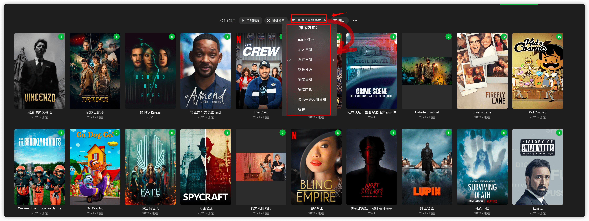

# 根据类型寻找影视剧

在终点站中根据类型寻找你想看的影片有两种方式：

- 根据终点站已分好类的风格寻找
- 根据影片详情里的分类标签寻找

这两种方法的具体操作方法如下

## 根据终点站已分好类的风格寻找

- 登陆终点站，然后选择任意影片分类点击进入

  

- 进入后点击 ***风格***

  

- 接着就可以根据想看的影片风格进行选择浏览 （如 ***喜剧***)

  

## 根据影片详情里的分类标签寻找

- 任意选择一部你想观看的影片风格的影片，（比如又是 ***喜剧***）在影片详情页就可以看到影片分类标签

  

- 点击这个标签，就可以找到此标签下所有影片。然后即可浏览和此标签相关的内容

  

## Some Tips

- 进入影片分类后还可以根据设置影片排序方式来更简便地找到你想观看的影片（比如加入日期或者评分）

  

- 点击排序方式胖的箭头，可更改排列方式，⬆️ 代表倒序，⬇️ 代表顺序

  