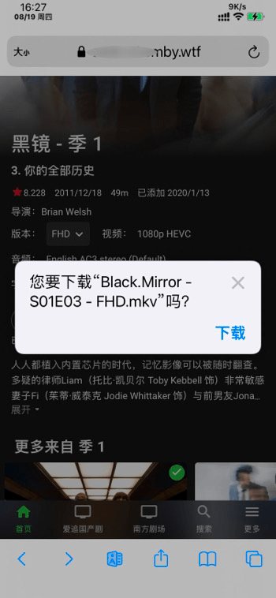
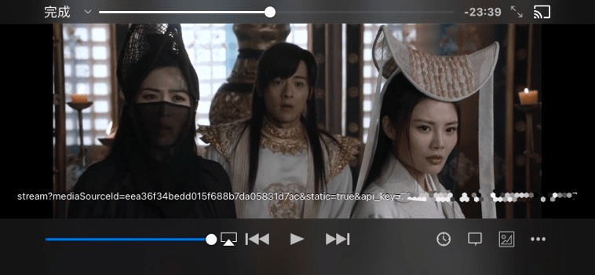
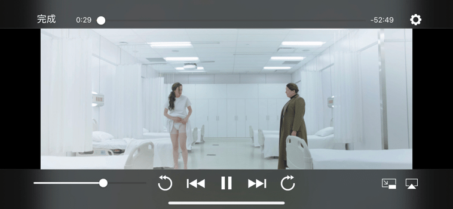

# 视频下载与外部播放 Quantumult X 模块

© 本教程内所有脚本皆为 [Emby 终点站](https://t.me/EmbyPublic) 原创，转载或魔改 (包括改为其他同类软件的模块或脚本) 请注明出处！

### ⚠️ 注意

1. 模块中包含播放权限解锁的脚本，如果之前使用了 [单独的破解模块](https://www.notion.so/Quantumult-X-05688368f2a14773865a0761da600b2f)，可以把那个模块禁用或删除。
2. 模块的下载和播放功能只能在浏览器中使用，不能在 Emby 客户端中使用！

### ⛔️ 封号警告

1. 请勿将下载链接复制到 **多线程下载** 工具中下载！
2. 请勿 **多任务大批量** 的同时下载！
3. 终点站有后台监控，超过某个阈值会自动封号，[封号记录查询频道](https://t.me/joinchat/U7M2tqH3NKErZmP_)

## 🙏 多合一模块

此模块包含了浏览器中下载视频、nPlayer 播放、VLC 播放、Infuse 播放的多种功能。

### 外部软件下载地址

1. [VLC for Mobile](https://itunes.apple.com/app/id650377962)
2. [nPlayer Plus](https://itunes.apple.com/app/id539397400)
3. [Infuse 7](https://itunes.apple.com/app/id1136220934)

### 模块安装及使用

1. 打开 Quantumult X ，点击右下角的圆形按钮；
2. 打开 **重写** 开关，并点击重写的 **引用** 按钮；
3. **标签** 任意，**资源路径** 填 `https://raw.githubusercontent.com/rartv/EmbyPublic/test/quantumult-x/emby.conf`，然后右上角保存；
4. 配置好 MitM 证书并系统信任，打开 **MitM** 开关；
5. 在 **Safari 浏览器** 中打开终点站 **网站**，在影片详情页中点击 **更多**（如果是剧集类型，需在要播放的那一集的详情页点更多按钮）；
6. 此时会看到各个不同的操作，根据需要选择。

> **⚠️注意：** Emby 网站的静态资源会长期保存在浏览器的缓存里，第一次使用此脚本需要 **手动清除浏览器缓存** 或使用 **无痕模式**！

### 限制

下载与外部播放功能只能在 iOS 浏览器中使用，不能在 Emby 客户端中使用！

### 🌐 浏览器中下载视频限制

1. 如果视频有外挂字幕且选中，则下载外挂字幕文件，否则下载视频文件。

### 🎬 使用 VLC 作为外置播放器在线播放限制

1. 如果一个视频对应多个外挂字幕，只会加载网页上选中的那一个字幕。

### 🎬 使用 nPlayer 作为外置播放器在线播放限制

1. 不支持外挂字幕。

### 🎬 使用 Infuse 作为外置播放器在线播放限制

1. 不支持外挂字幕。

## 效果

