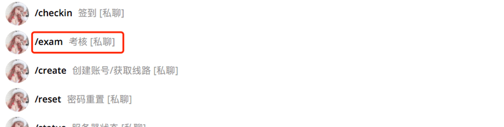
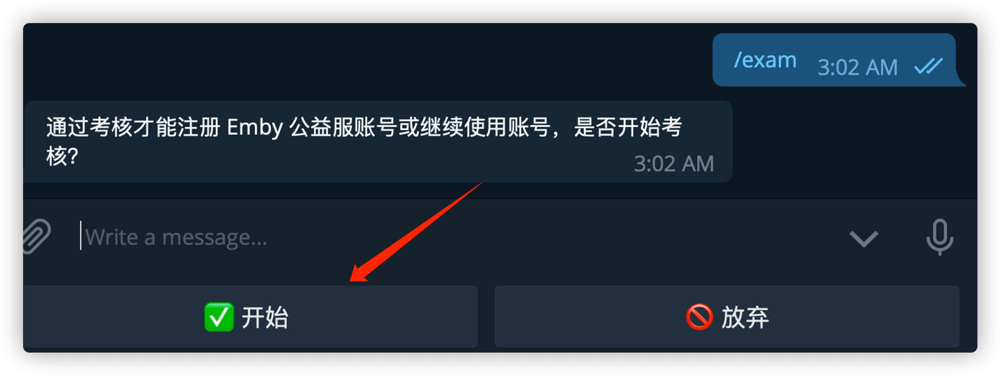
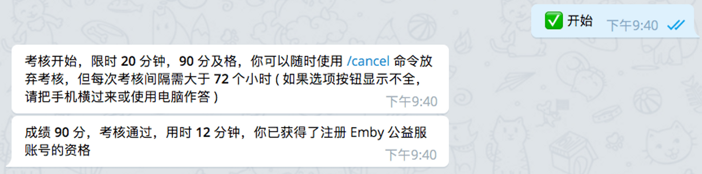
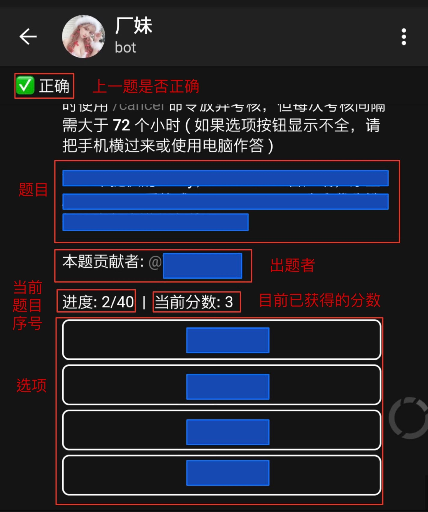

# 关于考核

**通过考核是获取账号的前提条件。**

## 考核的目的

本 Emby 公益服要求考核是为了：

1. 让用户了解 Emby 和 Emby 公益服的基本使用方法；
2. 让群里的技术交流变得更为高效和有意义，而非机械性地重复回答基础问题；
3. 确保用户在遇到问题时有寻求解决方法的基本能力；
4. 阻止机器人抢注和贩卖账号的牟利者，尽量让有需求的人获得使用资格。

### *如果你看到这里已经觉得很麻烦，欢迎左转不需要考核的其它公益服，或者订阅爱腾优奈的会员。*考核前的须知

- **每次**考试需要有足够的 *每日签到* 积分，*积分* 和每次考试所需的 *积分要求* 都可以通过 **厂妹Bot [@EmbyPublicBot](https://t.me/EmbyPublicBot)** 进行获取。
- 积分**仅**可以通过 *每日签到* 获取，每日随机获得1-5分。
- 考试开始前请自行测试厂妹Bot有否出现响应缓慢等状况，否则有可能会影响你无法按时完成考试。
- 考试正式开始后（即点击 **开始** 按钮后），即扣除所需积分并不会返还。开始考试前请确认准备充足且不会有其他因素影响考试。
- 如果发送 `/exam` 命令无法开始考试，请尝试发送 `/cancel` 后再次发送 `/exam` 。依旧无反应则说明题库正在维护，请关注并等待群公告通知。
- 如果题目有问题，请截图私信 [管理员](https://t.me/marioplumber) 告知。
- 严禁在群内或其它公开场合讨论题目或索要答案。这会被视为泄题行为，管理员可以直接ban，并删除相关消息。

## 考核的范围

考核内容包括

- [白嫖手册Wiki](ss)
- [提问的智慧](https://github.com/ryanhanwu/How-To-Ask-Questions-The-Smart-Way/blob/main/README-zh_CN.md)
- 群置顶资讯和通过简单搜索(例如 **[Google](https://www.google.com/)**)可获得答案的题目。

题目从题库里 **随机** 选择，所以每次考核的题目基本不一样。

*注：没有复习用的题库。考核是手段，不是目的。*

## 考核的形式考核内容为40题单选题，每题2.5分，最终得分90分（即正确36题）或以上者通过考核。

- 考核需要在20分钟内完成。
- 未通过考核者可以在72小时后再次尝试考核。

*注 1：由于机器人不显示小数点，所以会出现93分这种分数，实际分数其实是92.5分。*

*注 2：考核结束时若显示花费20分钟，即花费了20分钟以上21分钟以下的时间，实质上仍为超时。*

## 如何考核请向 **厂妹 [@EmbyPublicBot](https://t.me/EmbyPublicBot)** 私聊，发送 `/exam` 命令。

*注：如果发送命令后没反应，请先发送 `/cancel` 后再尝试。这是 Telegram 机器人的 bug。*

- 根据提示，点击**开始**，即可开始考试。

*注：如果没有看到**开始**按钮，请先发送 `/cancel` 后再尝试更换客户端考试。*

- 若考核通过会显示获得注册资格，在服务器开放注册期间即可**[创建账号](base/create-account.md)**。

## 考核的界面

## 来自满分大佬们的心得：

- 考试前请先仔细阅读[白嫖手册wiki](ss)
- 题目不会根据你的需求和使用环境调整，所以即使你认为某部分你用不到，也先了解大概内容，并在遇到相关题目的时候知道如何查找。
- 请先阅读一次[提问的智慧](https://github.com/ryanhanwu/How-To-Ask-Questions-The-Smart-Way/blob/main/README-zh_CN.md)，理解里面的原则。 这对你以后在群里的讨论和互动也有帮助。
- 考核是开卷的形式，部分问题需要上网搜索获取答案（除非你有广泛的知识背景）。
- 请仔细阅读题目，确保你没有理解错误。
- 考核时间为20分钟，只要了解考核内容，时间相当充分。如果遇到不确定的问题请花时间思考和上网查证。请自行准备计时工具以防超时。
- 即使你这次已经因为过多错误无法通过考核，继续答题仍然对你下次考核有所帮助。

## 来自被放逐者的教训

以下行为或发言可能会导致你被警告或直接封禁账号：

- 在任何地方（包括公益服讨论群）公开泄露或讨论考题。

  A：题库采纳的考题已经过水管工审查。如果对考题有异议，请私聊水管工。

- "为什么要考试？这是耍猴吗？"

  A：考核的目的请参考本页相关条目。

- "考试太难了。分数要求太高。"

  A：目前群里已经有超过1万人成功注册，所以通过考核并非无法企及的目标。*(话说你当年读书的时候会跟老师要求降低及格线吗？)*

- "我根本不会用XX，为什么要问我这种问题？"

  A：题目不会根据你的需求和使用环境调整。其他用户可能也不使用你在使用的设备。

- "这种问题根本和Emby/考核范围没关系。"

  A：此类问题的目的在于考核你的搜索能力。这符合 [提问的智慧](https://github.com/ryanhanwu/How-To-Ask-Questions-The-Smart-Way/blob/main/README-zh_CN.md) 里面的原则。

- "怎么注册？怎么考试？不会。"

  A：………………

### *如果你看到这里还是觉得很麻烦，请不要犹豫，本服务器可能并不适合不喜欢折腾的你。*

### *欢迎左转去往不需要考核的其它公益服，或者订阅爱腾优奈的会员。*

## 考核通过后的注意事项假设你考试通过了，那么还需要注意...

- 考试通过 **不等于** 可以立即 **[创建账号](base/create-account.md)**，需等待水管工开启注册（开启时间随缘，大家需时常关注终点站的 **[群组](https://t.me/EmbyPublic)** 和 **[频道](https://t.me/embypub)**）。
- 账号有效期从考试通过起 +365天，并非从获得账号起计算。
- 账号过期前**60天**内，可以通过考核延长账号有效期（此考试依然需要签到积分），或者在厂妹 Bot 使用 `/renew` 重置有效期（需要500签到积分）。
- 通过考核延长或使用`/renew` 重置的账号有效期为当前时间 +365天，此操作有效期不可叠加。
- 延长账号有效期的考核未通过时，账号的有效期保持不变，账号在有效期内仍能使用。
- 如果账号过期前未通过考核延长使用期限，Emby 账号会被[封禁](base/ban-track.md)。若要继续使用本 Emby 服务器则需要在厂妹 Bot 使用 `/rebirth` 解除封禁并重置有效期为365天（需要1000签到积分）。