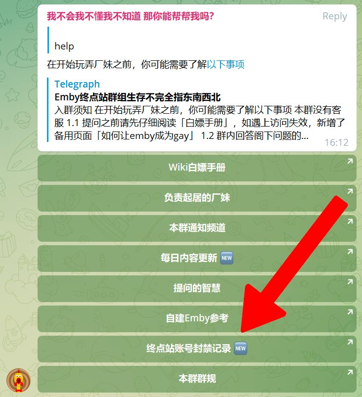

# 封禁查询

为了维护良好的交流空间和使用环境，终点站已逐步建立完善的规则系统，若违反规则可能会触发帐号被封禁。本页解释各种封禁原因以及如何避免被封禁。

## 查询封禁

从厂妹处得知被封禁后，请前往 [封禁频道](https://t.me/joinchat/U7M2tqH3NKErZmP_) 查询封禁缘由。若提示私密频道，请在 [@EmbyPublic](https://t.me/EmbyPublic) 发送 **help**，从机器人回复的链接进入。

私聊 [@userinfobot](https://t.me/userinfobot) 这个机器人，发送 `/start` 查询自己的 tg 数字 id，然后用这个 id 在频道里搜索自己的封禁情况。

## 封禁缘由解析

- 被 ban 了或已退群

  字面意思。

  **避免方法**：加入群组不要退、关注频道不走丢、多和厂妹说说话、了解群规不吃亏

- 疑似攻击 xxx 服务器，如为误封，请联系管理员

  常见于使用某些非寻常客户端，在播放时频繁寻求与服务器建立连接，造成攻击判定；也常见于主动/误使用下载器下载资源，下载器建立多线程连接，造成攻击判定。

  **避免方法**：不要使用非常规客户端，尽量不要下载视频或依据 Wiki 内方法下载

- 强制重考

  通过考试的情况下，在群内询问 Wiki/置顶/频道已有说明的问题而被管理员强制重考，详见 [重考规则](base/re-sit/index) 章节。

  **避免方法**：提问前请先看 Wiki 和置顶

- 超过 365 天未通过考核，账号过期

  考试通过起计算有效期 365 天，而非注册账号起，详见 [关于考核](base/about-exam/index) 章节。

  **避免方法**：在账号有效期前通过考试即可续期，或私聊厂妹发送 `/renew` 命令使用积分续期。

## 查询不到封禁原因？

由于系统Bug导致部分账号被封禁却无法查询到原因，一般均为超期未考核导致封禁，可至厂妹对话记录上次续期时间。

封禁缘由解析请参考上方 **超过 365 天未通过考核，账号过期**