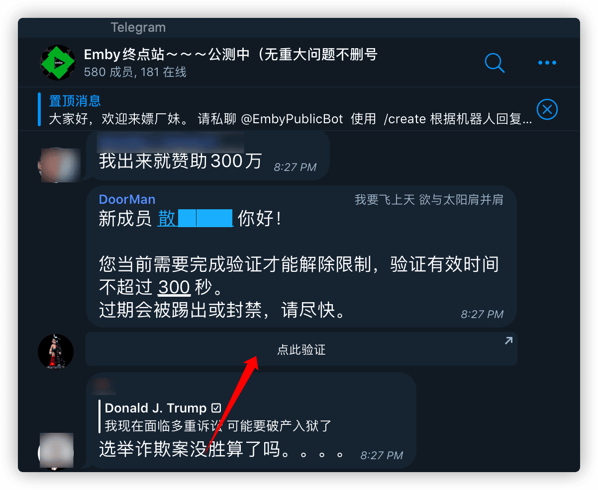
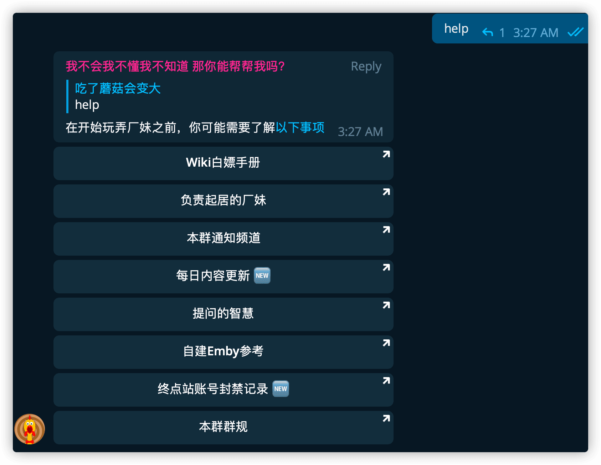
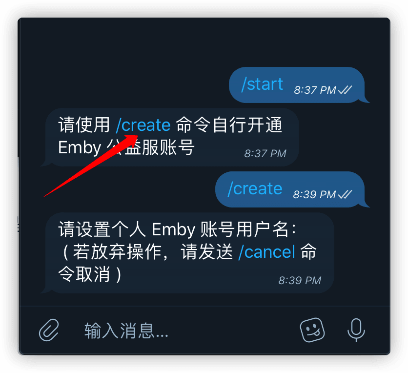
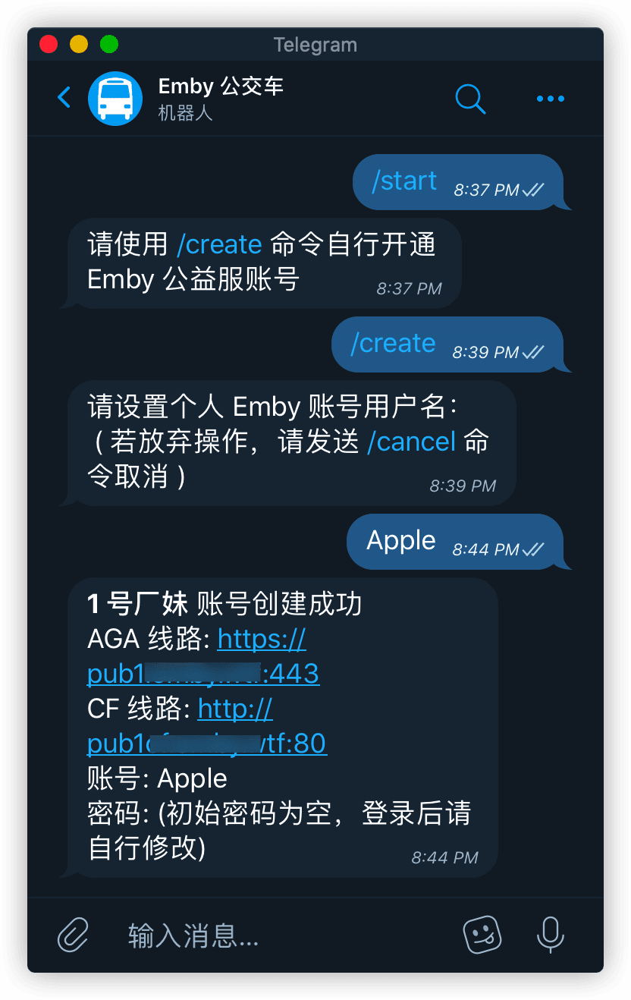
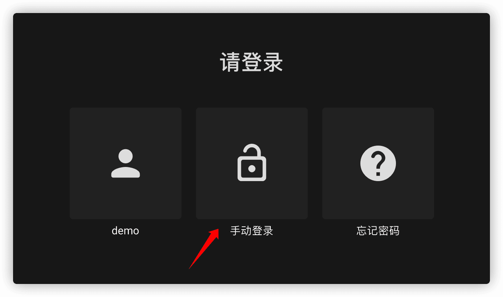
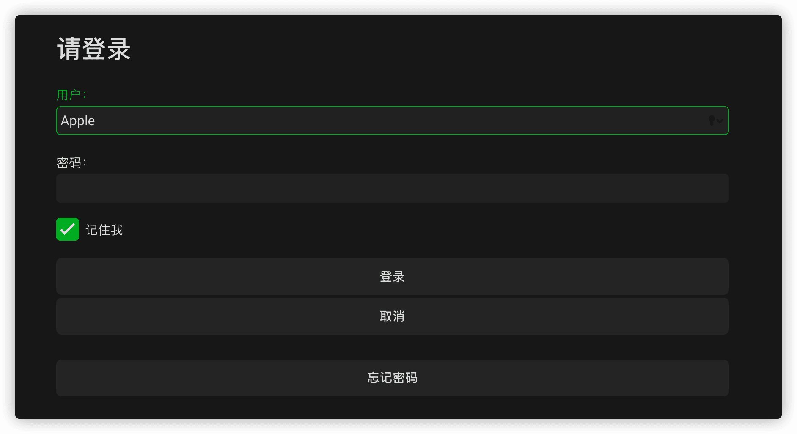
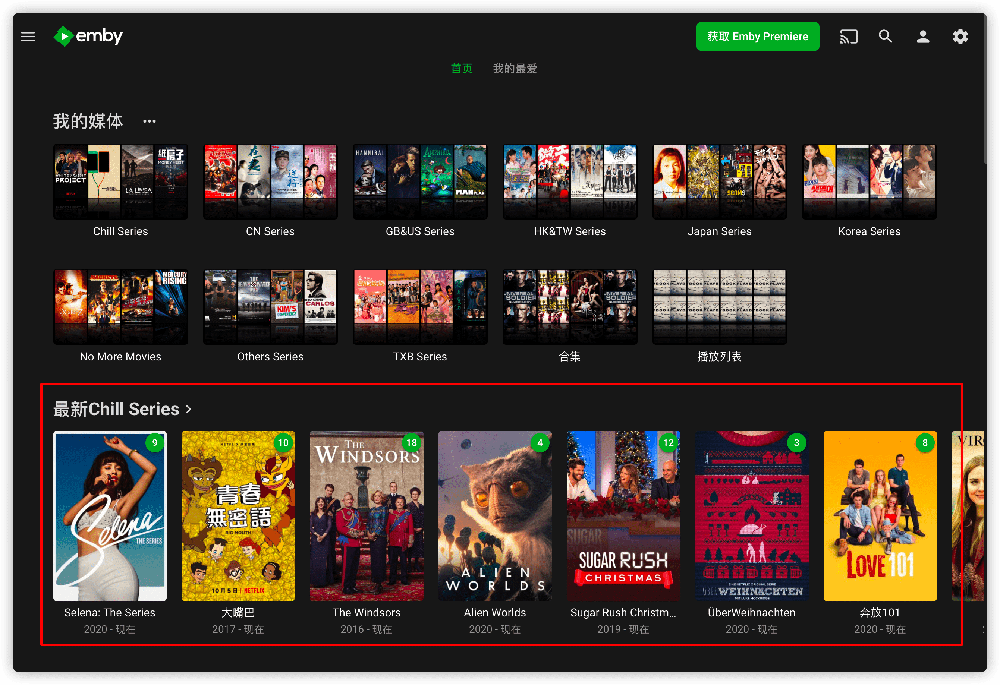
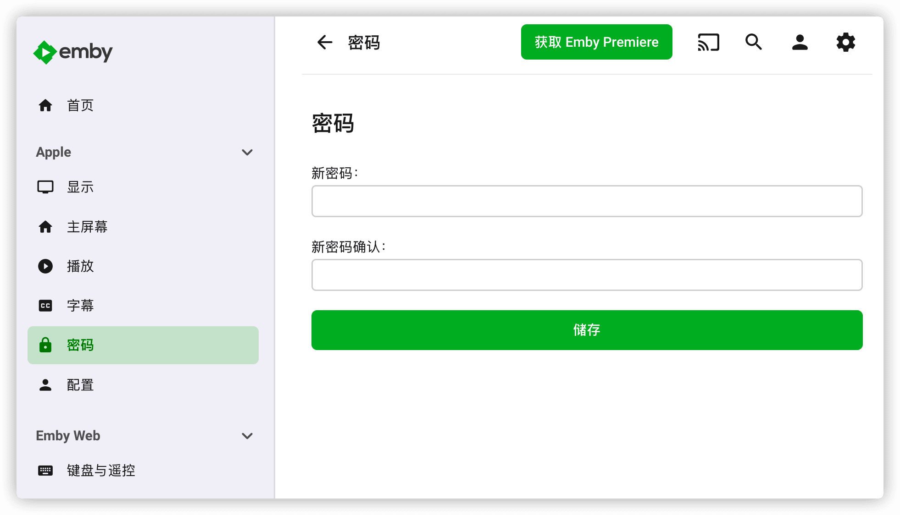

# 创建账号

**重要：请确保你已经阅读 [关于考核](base/about-exam/index) 一节。**

Emby 公益服可以为每人提供一个独立账号，这样就不存在大家使用相同账号导致播放记录一片混乱的情况。

## 创建账号

首先你需要是 [Telegram](https://telegram.org/) 用户，才能继续。

1. 加入 Emby 公益服 Telegram 群

 Emby 公益服 Telegram 群地址：[https://t.me/EmbyPublic](https://t.me/EmbyPublic)

 加群后请立即点击箭头所指的按钮私聊进群验证机器人回答一个问题，回答正确才算正式入群，回答错误会被机器人踢出群，但别慌，两分钟后可以重新加群再次挑战。

1. 阅读群内须知

 正式进群后确保将入群时提示的列表内的内容全都浏览一遍。如果入群时没有注意错过了，或者将来想要复习，可以在群组内输入 "help" 进行查看。

1. 积攒签到积分，并通过[考核](base/about-exam/index)

 签到和考核可通过私聊厂妹机器人 [@EmbyPublicBot](https://t.me/EmbyPublicBot)进行。如果未通过考核，即使开放注册了也无法注册账号。

1. 在**开放注册期间**创建账号

 私聊厂妹机器人 [@EmbyPublicBot](https://t.me/EmbyPublicBot) ，使用 `/create` 命令创建账号。

 发送 `/create` 后厂妹会让我们设置自己的 Emby 公益服账号用户名。*请勿重复发送命令，否则可能影响你正常注册。*

 在下面输入自己要取的用户名并发给机器人 ( 我取的账号名叫 Apple )，它就会为你注册一个公益服的账号并给你公益服的地址和端口（地址冒号后面就是端口号，在再设置客户端连接的时候需要用到）。

 *注：注册成功后请勿退群，否则 Emby 账号会被禁用。不小心退群的话请尽快重新加群。*

## 修改密码

> 现在新注册的账号已附有一个随机的初始密码。

由于刚才注册的用户名叫 Apple ，有点太普通了，万一被人猜到用户名和密码并登录看片，那我的播放记录不就乱了？所以还得赶紧去改个密码。用浏览器打开上面的链接，点 **手动登录**。

填上用户名和初始密码，点 **登录**

进去后我红框框住的那一排 Netflix 最新的剧集就映入眼帘了，美滋滋。但是别忘了我们是来干嘛的，是来改密码的。

点击右上角的小人图标，打开设置页面就可以修改密码了。