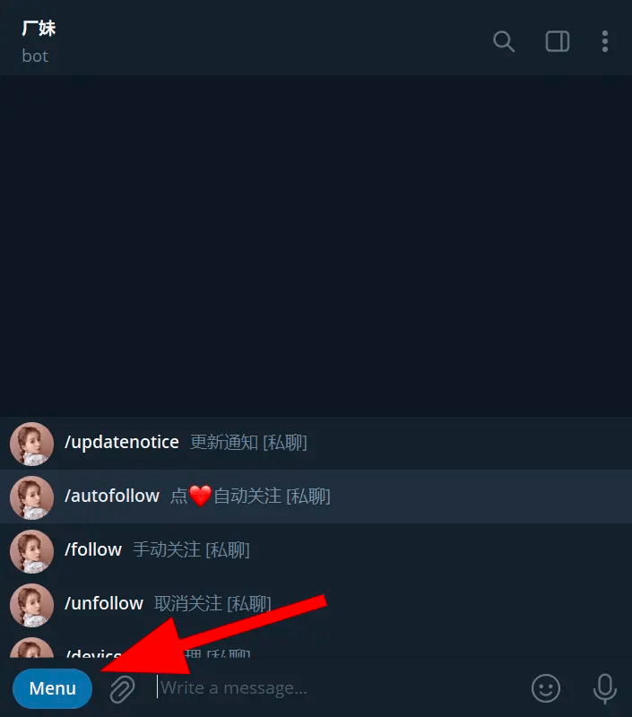
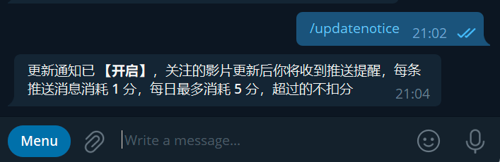
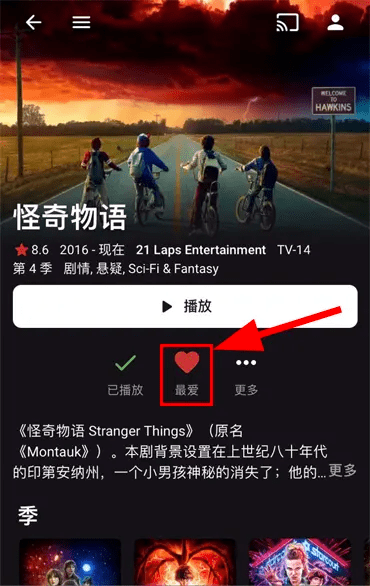
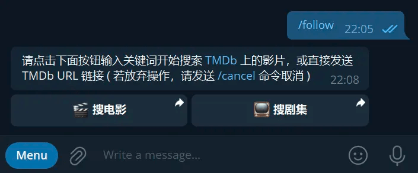
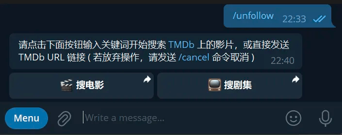
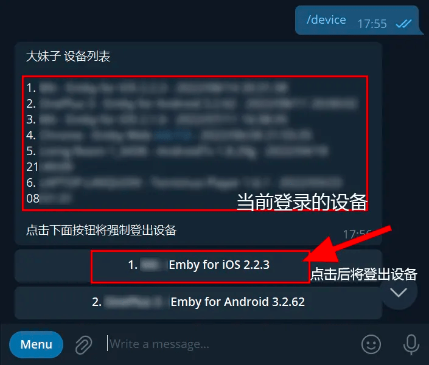
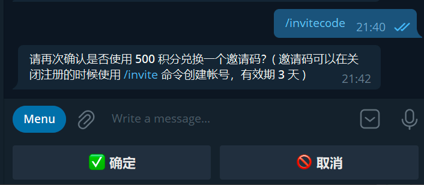
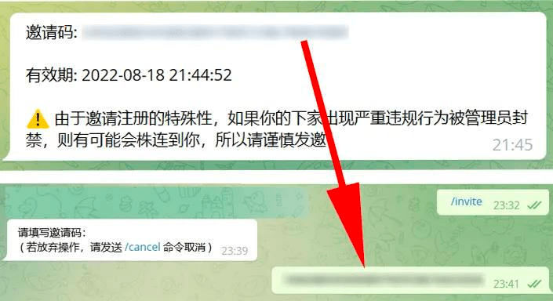
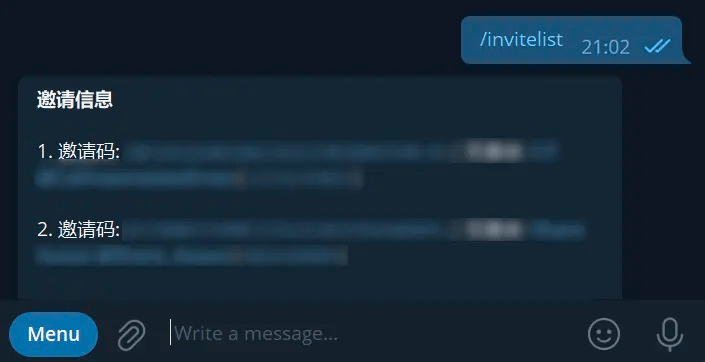
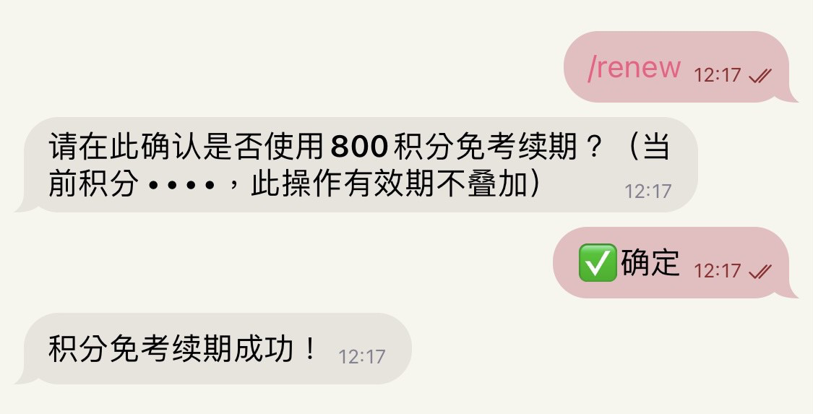

# 厂妹服务

厂妹业务愈发多元，为了更好地让厂妹为群友服务，本页介绍各个命令的用法。

以下服务**仅对已经拥有账号的群友有效，所有命令请 [私聊厂妹](https://t.me/EmbyPublicBot) 使用，若在群内发送将会被禁言！**

## 快速发送命令

打开与 [厂妹](https://t.me/EmbyPublicBot) 的聊天框，点击左下方 Menu，即可查看所有命令。点击命令后即可发送。

## 命令详解

### `/updatenotice` 更新通知

更新通知的开关，首次发送即可开启，再次发送则为关闭。

### `/autofollow` 点 ♥ 自动关注

> 由于终点站媒体库过于庞大，该功能可能无法正常工作

在 Emby 内点击喜爱自动关注的开关，首次发送即可开启，再次发送则为关闭。

此功能使用前提必须打开 `/updatenotice` 更新通知

随后厂妹会发送一个通知，提示该剧集关注成功

若不想再关注，请将该爱心取消；若该剧集已完结，也请将该爱心取消，减小服务器压力。

### `/follow` 手动关注

尚未更新在 Emby 的内容可以通过这个命令进行关注。

此功能使用前提必须打开 `/updatenotice` 更新通知

此时直接发送TMDB链接或点击搜电影/搜剧集搜索你想要关注的内容

关注成功后将会发送关注成功的通知

关注内容有更新时，在Emby客户端登录的情况下，可以直接点击按钮直接跳转客户端播放

### `/unfollow` 取消关注

通过这个命令进行取消关注。

直接发送TMDB链接或点击搜电影/搜剧集搜索你想要取消关注的内容

### `/device` 设备管理

列出当前存在登录状态的设备，进行注销登录操作。

请不要高频率进行操作，否则可能会被判定为 #刷子 导致禁止使用厂妹 7 天。

一般无需刻意进行设备管理。

### `/invitecode` 兑换邀请码

> 请不要以任何形式向他人索取邀请码，该行为将会被warn甚至ban。

使用 1000 积分兑换邀请码，通过邀请码注册无需通过考试也无需等待开放注册。

点击确定后，即可兑换邀请码。

**注意：**

- 邀请码仅允许**已有账号**的用户兑换；
- 仅可以将邀请码赠予值得信任的人，倘若注册者发生违规行为被管理封禁，你将会被连坐；
- 邀请码有效期为3天，请尽快使用；
- 邀请码无法用于自己的续期；
- 禁止将邀请码用于任何形式的交易行为，一经发现，交易双方都将被永久封禁。

### `/invite` 使用邀请码创建账号

发送 `/invite` ，根据提示兑换。

### `/invitelist` 邀请列表

查询所有使用由你生成邀请码的用户。

### `/renew` 免考试续期

可用积分免考试续期一年 ( 目前暂订 500 分 )。

### `/rebirth` 恢复被封禁的账号

可用积分恢复被封禁的账号并续期一年 ( 目前暂订 1000 分 )