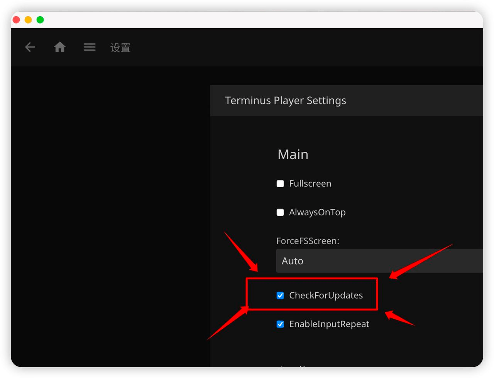

# 常见问题

## 区域限制

仅限 **中国大陆及港澳台**、**日本**、**韩国**、**新加坡**、**澳大利亚**、**新西兰** 的 IP 访问。( 使用 GCP 自建梯子的基本都是美国广播 IP，这些可能不能访问 )

## 关于线路

终点站提供全球高可用入口，但由于国内网络环境十分复杂，不同地区不同运营商观看体验大相径庭，请自行测试连接情况。若出现 **直连** 卡顿、无法播放等情况，请 **挂上梯子** 后再试试。如果都不行那就没办法了，毕竟不是开机场的，无法提供各种国内中转线路。

注：1. 请自行确认梯子是否生效。 2. 梯子是否适用以实际体验为准。"YouTube跑分几十万"没有任何意义，终点站毕竟没有全球CDN。

## 关于客户端选择

由于 Emby 特殊的机制，以及数据库的缺陷，客户端需要使用单线程进行播放，一些魔改或野生播放器会使用无脑多线程进行连接，大量的多线程会触发DDOS防御机制，导致自动封禁账号。

仅推荐使用 Emby 客户端、Terminus Player 以及外链调用播放器。

本 Wiki 未列出的客户端，不保证其可用性，因使用未列出的客户端而被封禁的账号，不予以解封。

本 Wiki 具有一定的滞后性，客户端限制变动请关注 [终点站](https://t.me/EmbyPublic) 群组置顶。

**如果需要使用 Infuse，请选择四妹，其他三个妹均无法使用 Infuse 连接，四妹也无法使用其他客户端连接。**

## 没有兼容的流

播放时提示 **没有兼容的流** 的原因很多，主要为以下几种情况：

- 网络卡顿

  与服务器连接缓慢，导致在缓存时间内无法加载到足够的内容导致无法播放，需要为 Emby 客户端或第三方播放器挂上梯子，请参考 **[备用Wiki](ss)** 中 **进阶使用**。

- 通过浏览器访问网页播放

  在网页上播放提示 **"没有兼容的流"** 、 **有声音没画面** 或 **没声音有画面** 。因为**大多数浏览器** 对部分音视频格式兼容性差，请详见 [电脑浏览器播放](usage/play-in-browser/index)。

## 公益服收费吗？

永远免费且无广告直到倒闭。

## 解锁 App 的钱去哪了？

iPhone/iPad/Mac 客户端上 30 元解锁正版 Emby 客户端的钱由 Emby 官方和苹果收取，公益服不收一分钱。

## Emby Premiere 和 Unlock Playback 什么区别？

Emby Premiere 用于服务端的高级功能解锁，为订阅制。非自行搭建服务器者请勿购买 Emby Premiere。

Unlock Playback 用于客户端播放权限解锁，为买断制。Unlock Playback 跟随账号，一个账号购买可多设备使用。

## 新开的服务器账号密码是什么？

如果你已有 **大妹** 的账号密码，则直接使用 **大妹** 的账号密码登录新服。

如果创建账号时遇到接口异常，请尽快反馈处理。

## 为什么四妹找不到XX影片但其他妹能找到？

所有妹（服务器）的影片库是完全一样的。

Infuse由于其特殊的扫库机制，在公益服影片以及剧集众多的情况下容易产生遗漏，导致搜索时会出现缺失。

重新扫描**可能**可以解决，但更建议换用其他妹通过 Emby 客户端或外链调用Infuse观看。

*注：如果在四妹搜索不到某影片或剧集，请先搜索一二三妹。原则上不处理四妹的影片缺失问题。*

## iOS 客户端中文字幕太小怎么办？

给 [Emby 官方反馈](ss)

Emby 官方已于 2020-12-26 修复了此问题，升级到 `v2.0.2` 或更高版本即可

## 播放记录不同步

Emby 公益服的每台服务器都是相互独立的，在某台服务器上的播放记录与收藏的影片并不会同步到其他服务器上去。

## 厂妹Bot反应很慢或无反应

通常是因为有大量指令被发往厂妹，常见情景为有人调戏攻击厂妹或者大量新用户注册时。出现此情况请耐心等待厂妹回复，切勿重复发送指令。此时发送过多指令有可能会触发厂妹的封禁机制。

当厂妹没有反应，且确定不是上述情况时（如群里没有很多人报告无法使用厂妹亦或无人触发厂妹的封禁机制），此时应该发送`/cancel`先取消当前会话，然后重新发送你需要执行的指令，比如`/checkin`签到或者`/exam`参加考试等。

## Terminus Player反复提示更新

由于 Jellyfin 上游更新了客户端，导致 Terminus player 会收到更新提示。此时请不要更新，否则使用 Emby 时会遇到功能上的不兼容，甚至会被短暂地自动封禁。如果不小心升级请卸载后重装 Terminus player。更新检测可手动关闭（见下图）。

## 安装 Terminus Player 时提示已安装更新的版本

Terminus Player 基于 Jellyfin 播放器，若已经/曾经安装新版本的 Jellyfin 播放器可能会导致无法安装 Terminus Player。如出现该提示请彻底删除 Jellyfin 播放器及相关文件。

## 苹果系设备上 Emby 官方 App DTS 音源内容无法播放

旧版 Emby 官方 app 在苹果设备（手机、平板、电脑等）上无法解码 DTS 音源，导致播放相关内容时，无法输出对应的声音，具体表现为只有画面输出，无声音播放，部分设备会在长时间转圈加载后，输出无兼容流的错误。

可更新至最新版官方 app（电脑版需在Emby官网下载）或者通过外链播放解决。

## 缺少**影片字幕**

公益服影片众多，因来源不一，难免有字幕相关问题出现

- 影片缺少字幕怎么办？

  使用外链调用播放器后，自行寻找字幕并在播放器内挂载观看

- 使用 Emby 观看时有字幕，但外链播放反而没有字幕？

  该字幕并非内封/内嵌字幕，而是外挂形式，外链播放时无法读取。

  遇到该情况请使用客户端或自行寻找字幕并在播放器内挂载观看

## **关于意见反馈和求资源**

问题反馈进表填写 欢迎多多反馈 以及欢迎各路大咖们帮助解决[填表link](https://docs.google.com/spreadsheets/d/1_ZGuvqAjU6Lw5eush1Bq7-97nU7MHwSs3P-UgvhD5Zg/edit#gid=0)

反馈求资源渠道暂时取消。