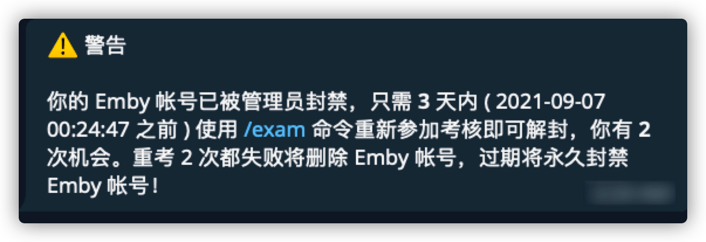

# 重考规则

### 重考主要用于防范账号交易，同时也警示长期未阅读Wiki的用户能够及时温故而知新

- 重考规则适用于 **所有** 已经通过考试，并已经拥有有效终点站账户之用户
- 使用者在 [终点站群组](https://t.me/EmbyPublic) 内提出本 Wiki 中涉及并已给出解决方案的问题，管理员有权对其发出重考要求
- 被要求 **重考** 的用户会在 [厂妹](https://t.me/EmbyPublicBot) 对话中获得提示

- 获得 **重考** 提示的用户会被即刻禁用账户，直至重考通过
- 获得 **重考** 提示的用户可以在收到提示后的规定时间内，通过 [厂妹](https://t.me/EmbyPublicBot) 考试命令，参加重考。考试相关事项请参考 **[关于考试](base/about-exam/index)**
- 在规定时间内使用系统给予的重考次数，无需交纳报名分（签到积分）
- 系统给予的重考次数皆未及格，系统立即删除账号，需要重新使用积分参加考试，等待注册开启时重新注册账号
- 在规定时间内未参加考试，或在考试未及格的情况下没有将系统给予的重考次数使用完，原有终点站账号将被永久封禁
- 重考及格**不会**延长帐号有效期