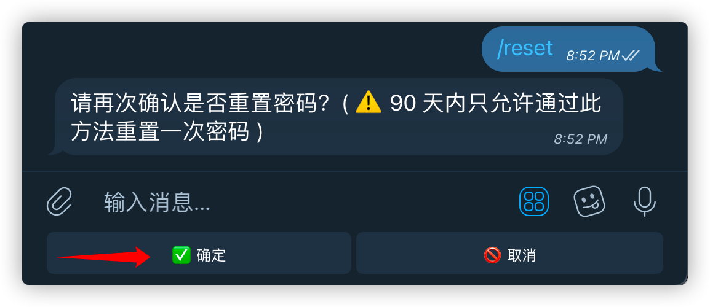
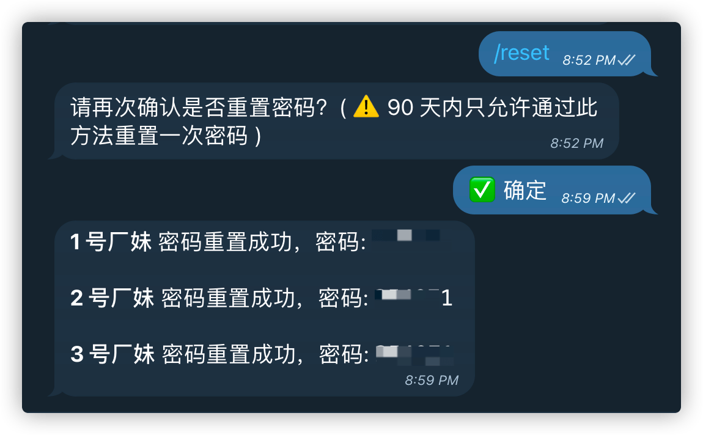

# 密码重置

正常情况下，修改密码只需要在 Emby 客户端上修改即可。

但有的时候，由于一些不知道什么原因的原因，密码丢失了，则可以通过机器人 [@EmbyPublicBot](https://t.me/EmbyPublicBot) 重置密码。

发送 `/reset` 命令后确认是否重置密码

点击 **✅ 确定** 按钮，会把所有 Emby 服务器上你的账号密码给重置

> Emby 公益服的每台服务器都是相互独立的，修改某台服务器上的密码后并不会同步到其他服务器上去，需要自己手动修改。