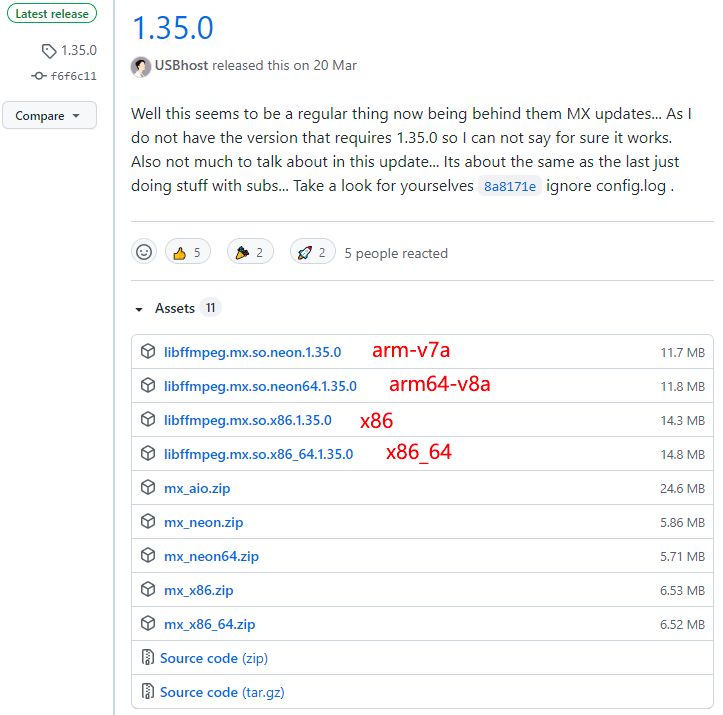
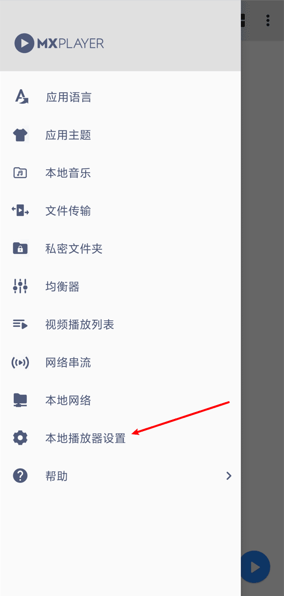
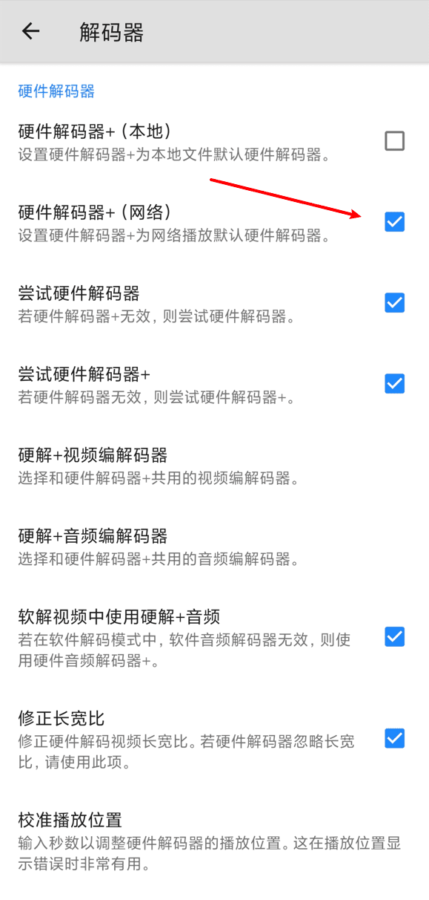
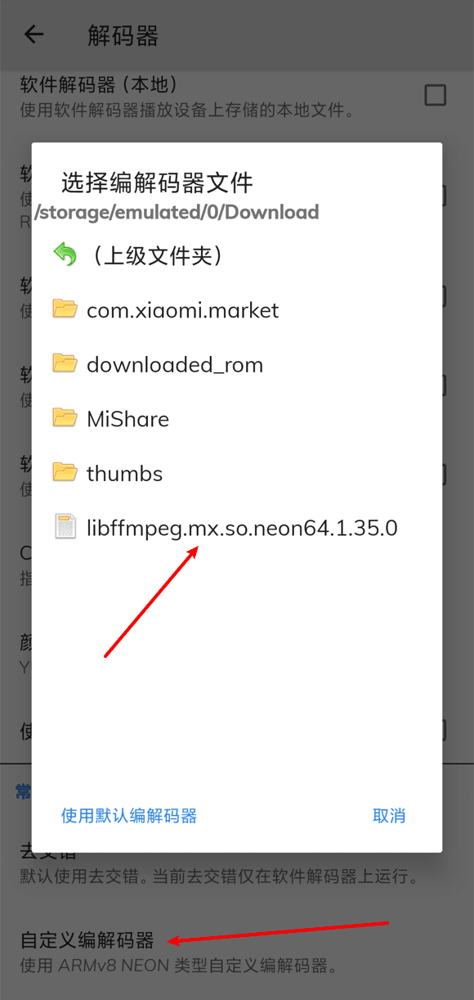
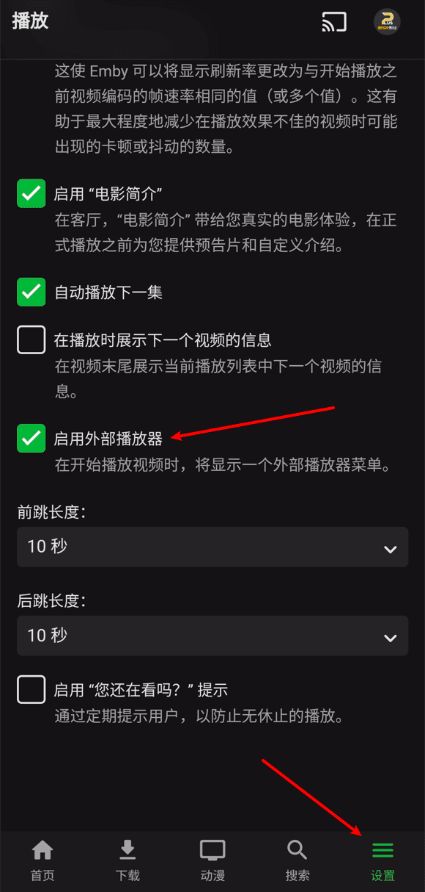
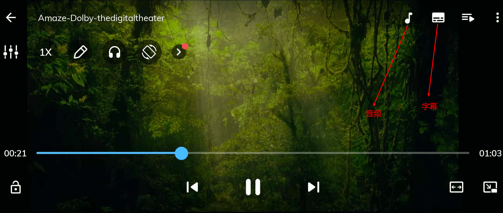

# Android 上使用外部 MX Player 播放（搭配定制改版 Emby 客户端可保存播放记录）

> 感谢群友david提供方案

Android 用户如果对 Emby 官方客户端的内置播放器不满意，可以使用 MX Player 作为外部播放器。

## 下载并安装

你可以在 [Google Play](https://play.google.com/store/apps/details?id=com.mxtech.videoplayer.ad) 下载 MX Player。

## 调整MX Player设置

1，由于版权原因，MX Player 不支持 DTS，AC3 等音频编码，需要下载修改后的解码器（[下载地址](https://github.com/USBhost/MX_FFmpeg/releases)）并拷贝到 Android 设备中。

2，打开 MX Player，点击 **菜单栏** -> **本地播放器设置**。

3，点击 **解码器**，勾选 **硬件解码器+（网络）**。

4，点击最下方的 **自定义编解码器**，选择 **第一步** 下载的文件，重启 MX Player。

## 允许Emby使用外部播放器

打开 Emby，点击 **设置** -> **播放**，勾选 **启用外部播放器**。

## 注意事项

1. 如果 Emby 中点击播放后无法选择 MX Player，请重置 Android 应用偏好设置。

2. 第一次使用 MX Player 播放需建立字幕字体缓存，请耐心等待。

3. 修改音频和字幕，请点击下图所示按钮。修改字幕样式，请点击 **菜单栏** -> **本地播放器设置** -> **字幕** -> **外观**。

   

## 定制 Emby V3.2.26 客户端下载

[点击下载](https://github.com/Terminus-Media/Terminus-client/releases/download/0.0.2/emby.v3.2.26.apk)

使用此版本客户端，调用 MX Player 播放后，可以在 Emby 端保存播放记录

**注意：调用外部播放器保存播放记录功能，仅对 MX Player 有效**