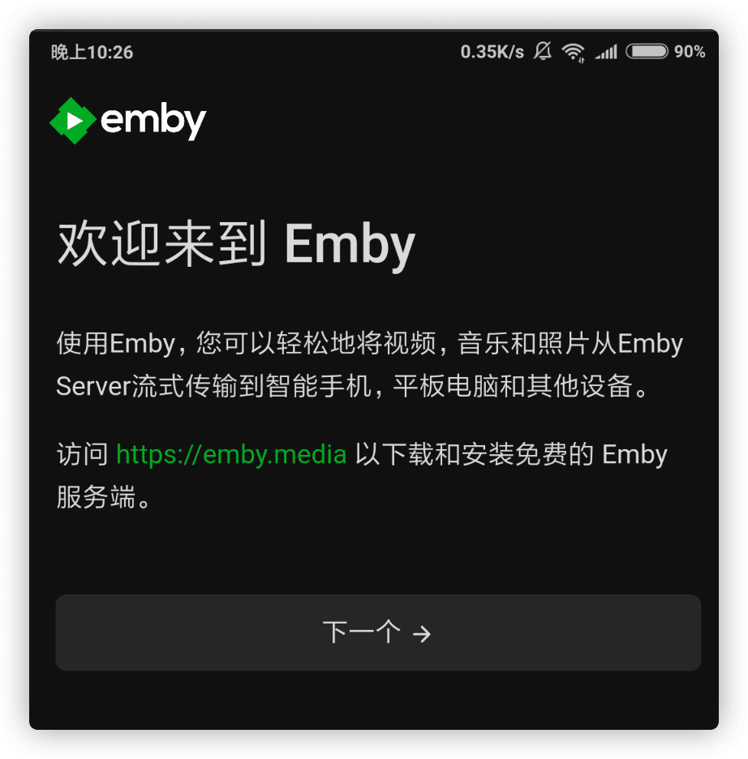
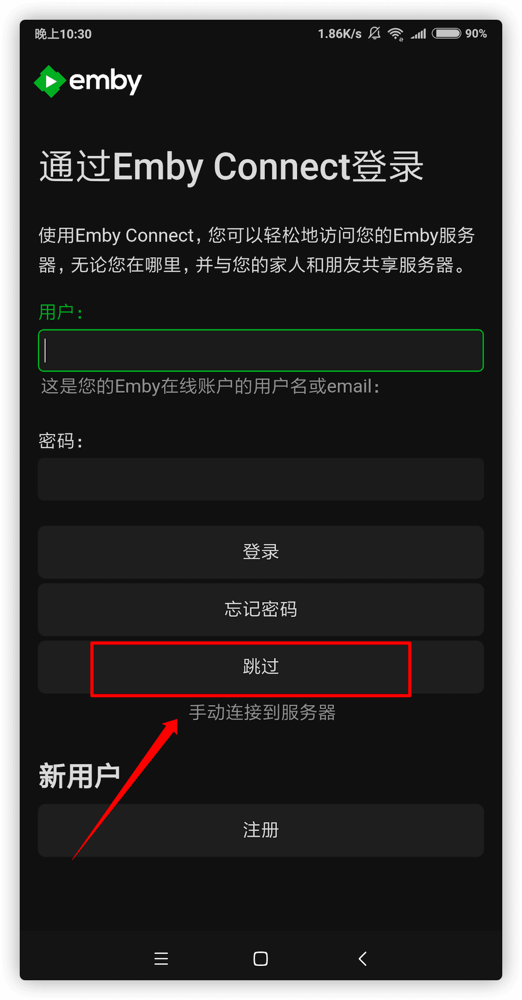
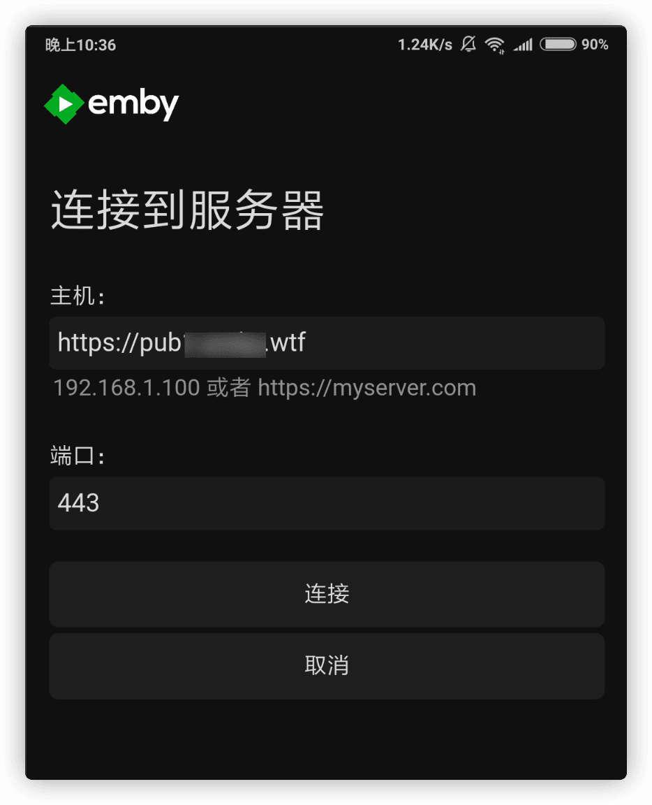
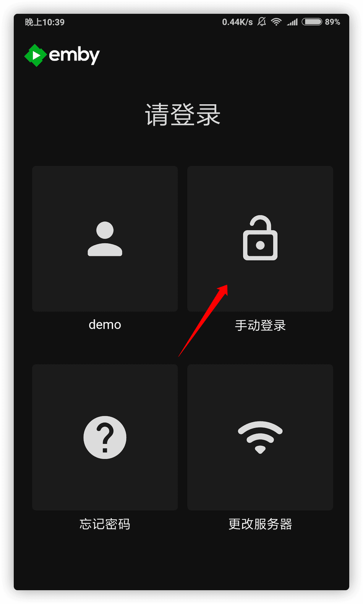
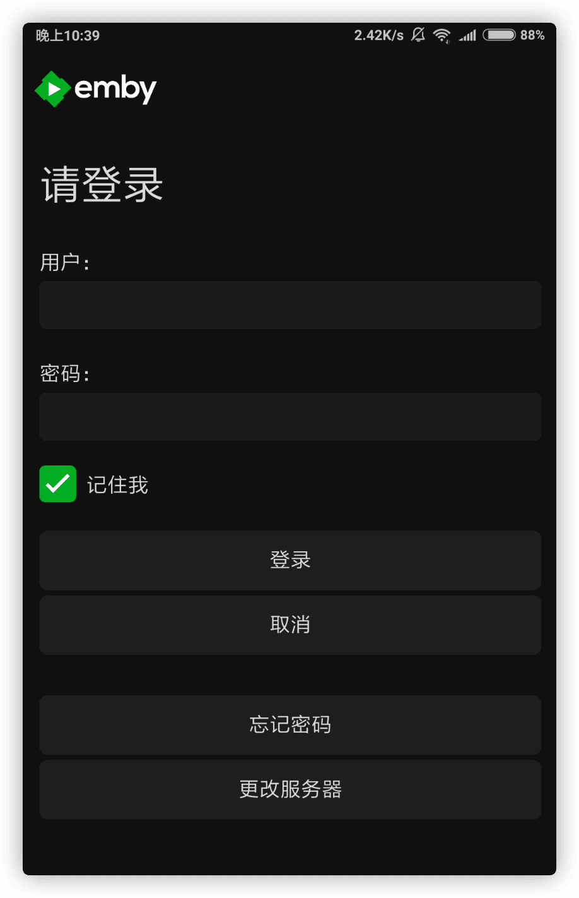
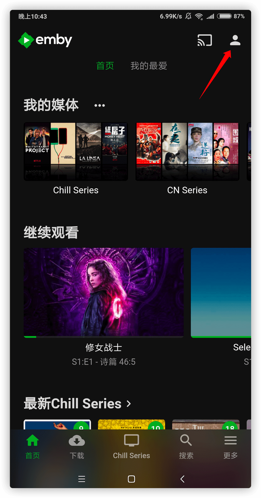
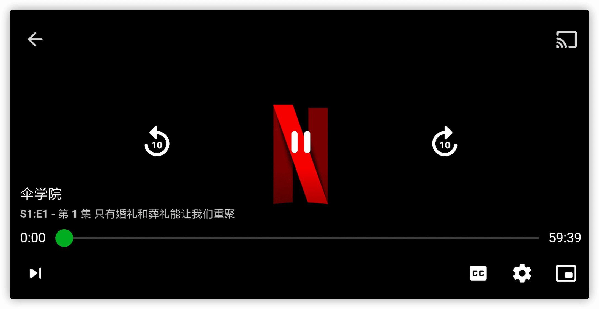
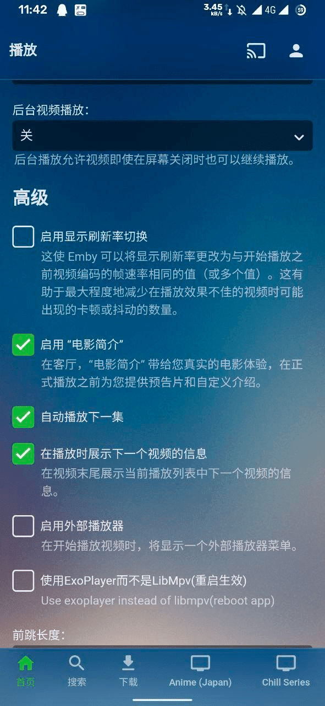
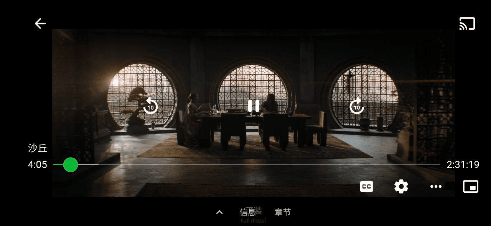

# Android 手机上使用官方客户端

Android 手机用户可以直接使用 Emby 官方客户端播放公益服视频，无需付费或者去用破解版。

## 下载并安装

你可以在 [Google Play](https://play.google.com/store/apps/details?id=com.mb.android) 或者 [Emby 官网](https://emby.media/emby-for-android.html) 下载 Emby 客户端。

## 连接 Emby 公益服务器

欢迎界面点 **下一个**

点击 **跳过** 按钮，我们手动连接服务器（因为 **公益服账号不是 Emby Connect 账号**，这是两个不同的东西）

填写机器人给你的公益服地址和端口号（**注意**: 机器人提供的地址和端口是写一起的，而这里要分开填写），然后点击 **连接** 按钮

点击 **手动登录** 按钮

填写自己的账号密码点击 **登录** 按钮

## 调整字幕大小开始撸剧

登录后点击右上角的小人图标，设置一下字幕大小就可以找片子来看了。

### **修改版 1**

由于官方原版的字幕字体看着难受，所以这里提供一个修改版：**[点击下载](https://github.com/rartv/EmbyPublic/releases/download/0.0.6/Emby.for.Android.3.1.73.Cracked.apk)**（如果安装失败，请先卸载官方原版后再试）

**效果如图↓**

### **修改版 2**

**感谢群友 seeyoung6 提供 [点击下载](https://github.com/Terminus-Media/Terminus-client/releases/download/0.0.1/Emby_3.2.26_MPV_Exo.apk)**

> 如果安装失败，请先卸载官方原版后再试

- 可以自由切换 exo 还是 mpv，默认 mpv，在 设置-播放 中更改。
- 增大了 mpv 的缓冲大小，修改为 200mb/10分钟。
- 修复了部分手机使用 mpv 播放 10bit 视频黑屏的 bug。
- 修复了 mpv 快进的 bug。
- 解锁 premiere。

**预览图↓**

