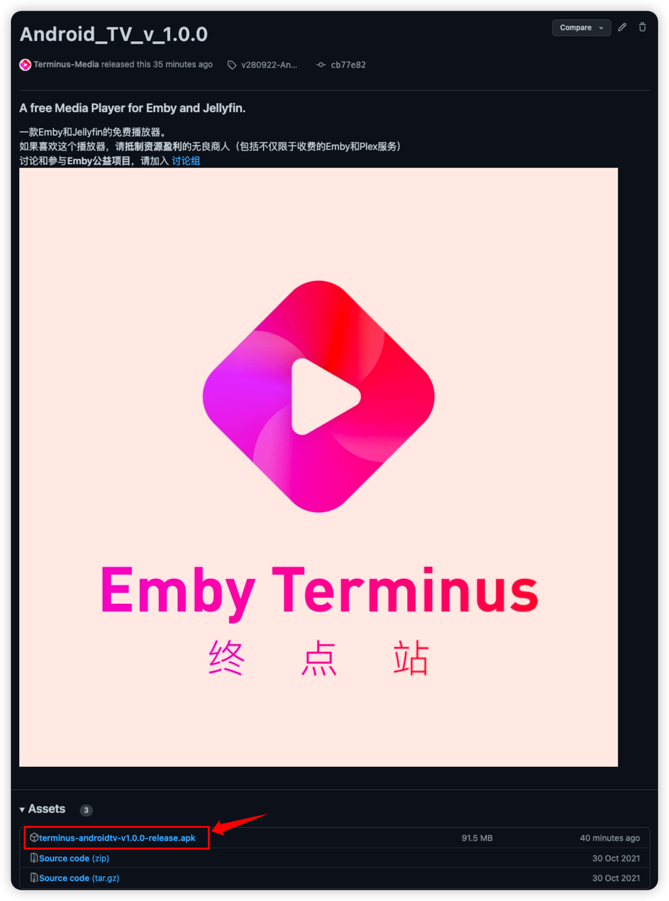

# Android TV 上使用Terminus Player客户端

## Terminus Player 介绍

本播放器是终点站大佬基于 [Jellyfin-media-player 项目](https://github.com/jellyfin/jellyfin-media-player) 修改的一款播放器，主要特点是：

- 对原项目不支持 Emby 进行了修改，使得绝大部分功能能够正常使用；
- 界面更加美观；
- 安装、使用轻盈方便，两键（双击）安装，即可使用。

> 这是一个修改版的软件，如果报木马，提示有害软件，自行验证是否可安装。设备爆炸不负责任。

## 软件安装

从本播放器的 [github release 页面](https://github.com/Terminus-Media/jellyfin-media-player/releases/tag/v280922-AndroidTVv1.0.0) 下载安装包，如下图所示。认准后缀为 `.apk` 的文件，点击下载。下载完成后解压得到 `terminus-androidtv-v*.*.*-release.apk` 文件，即完成。

想办法把下载好的 apk 传输到 Android TV 设备，或借助其他软件进行远程安装

安装完成后在设备上打开 *Terminus Player*

终点站的当前所有服务器已经内置在 *Terminus Player* 中，选取即将登陆的服务器，输入用户名密码进行登陆