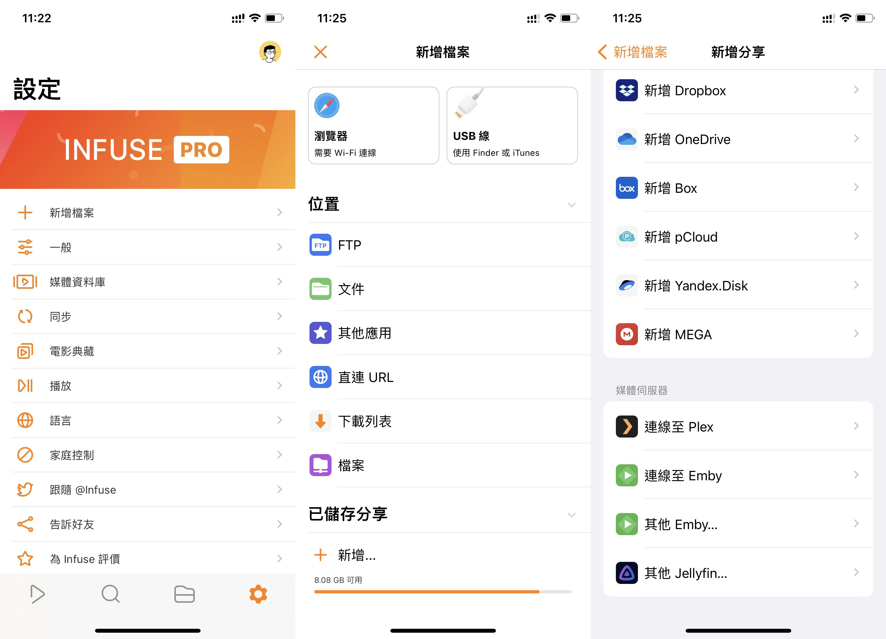
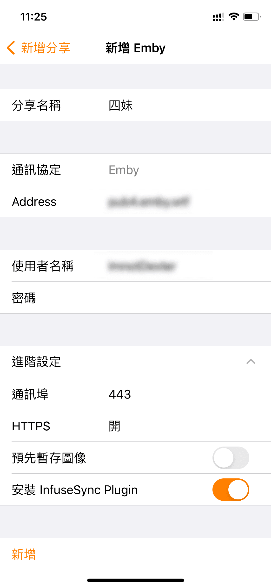
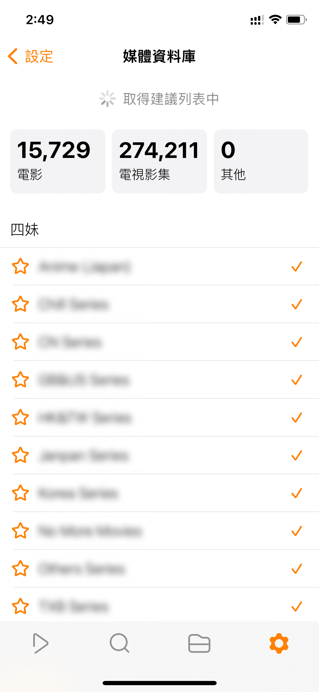

# iOS 上使用 Infuse 客户端

> **2022年9月28日，终点站上线四妹 for Infuse Only，通过万人同扫技术重新支持了Infuse。**

## Infuse 介绍

[Infuse](https://apps.apple.com/app/id1136220934?mt=8) 是一款在 iOS / tvOS 上非常出色的媒体库管理软件。它和 Emby 类似，不同的是 Emby 分为服务端和客户端，而 Infuse 没有服务端，媒体管理全在客户端完成。

2020 年，Infuse 6 新增了 Emby 协议 ( 可以作为 Emby 客户端来使用 )，解决了 Emby 官方客户端播放器解码能力差，特效字幕处理极差的窘境。

然而 Infuse 价格不菲，2019 年终身订阅售价 $54.99 美元，2020 年 1 月涨价到 $59.99 美元，2020 年 12 月 6 日涨价到了 $64.99 美元，2021 年 1 月 1 日涨价到 $69.99 美元，目前价格为 $94.99 美元。这让很多人望而却步。

有的人因此去淘宝买黑卡 Infuse 兑换码，甚至用 **“隔夜饭”**（某付费 Emby 服务商的尊称）提供的共享账号来安装，他的共享账号很大可能也是黑卡。一旦被盗刷信用卡的人找到银行，银行找到苹果，那苹果轻则封号，重则封锁使用共享号人的 iPhone/iPad 或 Apple TV 。想想都恐怖，所以我希望大家远离黑卡，远离 “隔夜饭” 这种无良商家。

*注：Infuse每次打开都可能需要扫库更新数据，请自行斟酌是否使用。因此不要来问 “每次打开Infuse都在扫库/转圈怎么办” 等问题。*

## 如何获取 Infuse 呢？

有三种途径：

1. 通过 [App Store](https://apps.apple.com/app/id1136220934?mt=8) 下载并在软件内正价购买。我个人建议购买 Lifetime 版，也就是终身版。
2. 申请成为 Infuse 的测试员，从 [TestFlight](https://apps.apple.com/us/app/testflight/id899247664) 下载测试版 Infuse。因新功能都会先发到测试版上，所以测试版的功能甚至比正式还多些。这也是唯一免费获取 Infuse 的途径，其他皆盗版。（现在 [Infuse 7 的 TF 版](https://testflight.firecore.com/) 需要购买的收据才能申请，白嫖已结束）
3. 可以通过合租群组通过家庭组的方式合租家庭组，不推荐采用 trakt 分享 Infuse pro 的方式的合租，采用 trakt 分享的方式会有诸多限制，在此不予赘述，同时请不要购买淘宝/闲鱼等平台上的便宜的号称“终身版”的 Infuse。

## Infuse 上使用 Emby 公益服

打开 Infuse 的设置页，点击 **新增文件来源** → **添加媒体服务器** → **其他Emby**。

填写公益服的 **地址**、**端口**、**账号** 和 **密码**，然后 **保存**，点击 **新增**。（注意：地址栏不用填写 https、端口以及斜杠；端口在高级中填写，HTTPS 应为 **开启**；预缓存图像 建议 **关闭**。）

开始自动同步数据（数据同步完成后，主页才会显示海报墙，其他平台客户端的同理。）

**注意**：如果同步一开始就卡住，那就去掉 “**合集**” 与 “**播放列表**” 栏目后面的 ✓（Infuse 6.5.8 (6.5.3407) TF版已修复此问题）

等二三十分钟左右（建议提前将自动锁屏关闭），待公益服数据同步完成后就可以回到媒体库（首页）选择影片或者搜索影片了。**同步时不要把 Infuse 退到后台。**

选择影片，点击观看。

> 如果你拥有 Apple TV 且使用了和 iPhone/iPad 相同的 Apple ID ，Infuse 则可以通过 iCloud 把 Emby 服务器连接配置同步到 Apple TV 上，实现大屏观影。

## Infuse同步时“目录错误”

1. 保证自己与 4 号机有一个高速且稳定的网络环境！经过抓包分析发现，在数据同步的过程种，有很多请求返回的数据包很大，如果不能在 60 秒内把那个数据包下载完成，Infuse 就会中断这个请求，出现 “目录错误”。
2. 如果网络质量不佳，可以考虑一个栏目一个栏目的逐步同步。
3. 推荐使用 Infuse6 ，因为 Infuse6 + 超级大的终点站影库在冷启动时首页加载会比 Infuse7 快N倍。
4. 如果设备上的 Infuse 曾经导入过其他比较大的库，建议卸载并重装一次 Infuse ，以便 Infuse 重建数据库。否则 Infuse 可能会出现严重的性能下降问题。