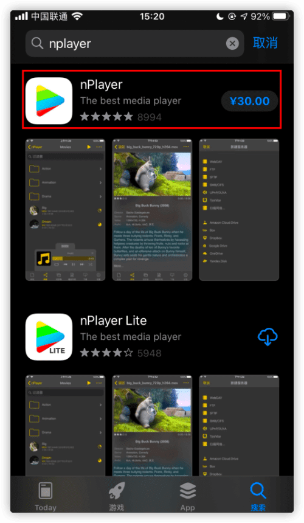
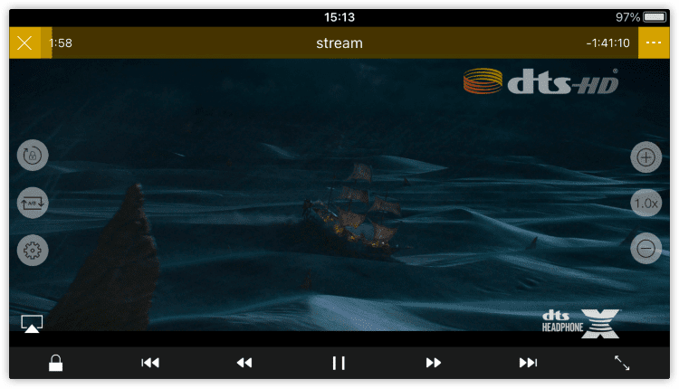
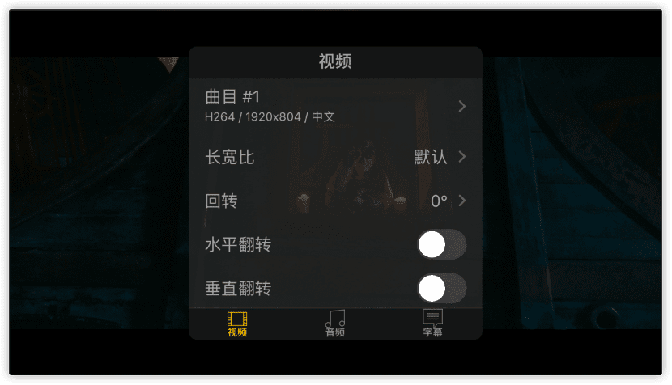
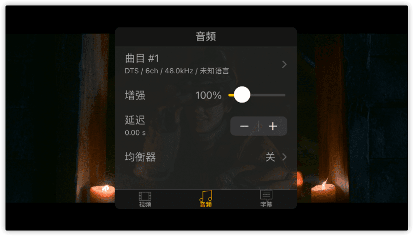
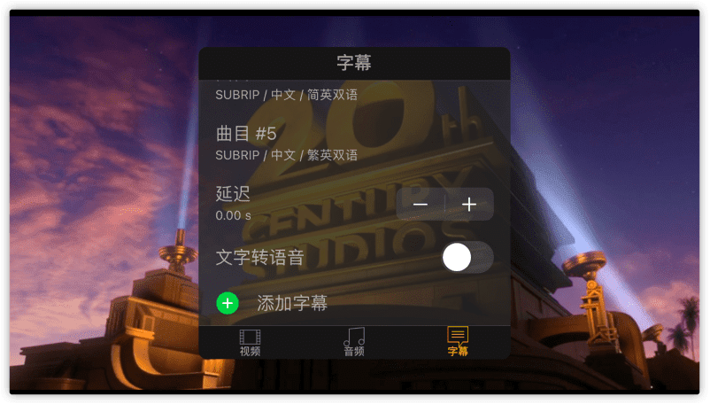

# iOS 上使用 nPlayer 客户端 (适用于 iPad)

## nPlayer 介绍

[nPlayer](https://apps.apple.com/us/app/nplayer/id1451273814?mt=12) 是一款多平台通用的播放器。支持/兼容常见所有媒体格式，包括（不仅限于）iOS Emby APP 不支持的 DTS 音频格式。可添加多种流媒体服务器，并内嵌浏览器，通过内嵌浏览器播放内容时，自动调用 nPlayer 进行播放，以达到全格式兼容的目的。

同时，nPlayer 价格便宜，国区 App Store 售价 30 元人民币，可谓价廉物美，是 Emby APP 和 Infuse 之间的折衷选择。

## 如何获取 nPlayer 呢？

- 通过 [App Store](https://apps.apple.com/us/app/nplayer/id1451273814?mt=12) 购买。该链接为美区链接，国区价格更为优惠，请自行选择。

- 注：免费的 Lite 版带广告，且不支持 DTS 格式音源，所以无任何使用体验上的帮助

## nPlayer 上使用 Emby 公益服

打开 nPlayer 软件， 点击底部浏览器，并在跳出的浏览器地址栏中输入从 [厂妹](https://t.me/EmbyPublicBot) 获取到的地址信息，然后在 *用户* 和 *密码* 栏中输入自己的用户名和密码。

> 注：如需保存地址，可以点击地址栏右侧的 *书籍* 图标，以添加书签，方便日后再次使用。

正确登陆后，即可使用。

接下来，我们测试一下 iOS 设备上最主要的问题：DTS 音源的播放

找到任意一部 *音频* 内容为 *带有DTS* 字样的影片

点击播放，稍事片刻后，正片出现的同时，就可以看到右上角已经显示正确辨识 *DTS* 的 logo

此时已经完美音画同步，同时也可以在影片详情中进行 *字幕选择* 以及 *倍速播放*，甚至是 *外挂字幕*

可以开始愉快的看片了，同时，这个方法也适用于 *iPad* 设备

