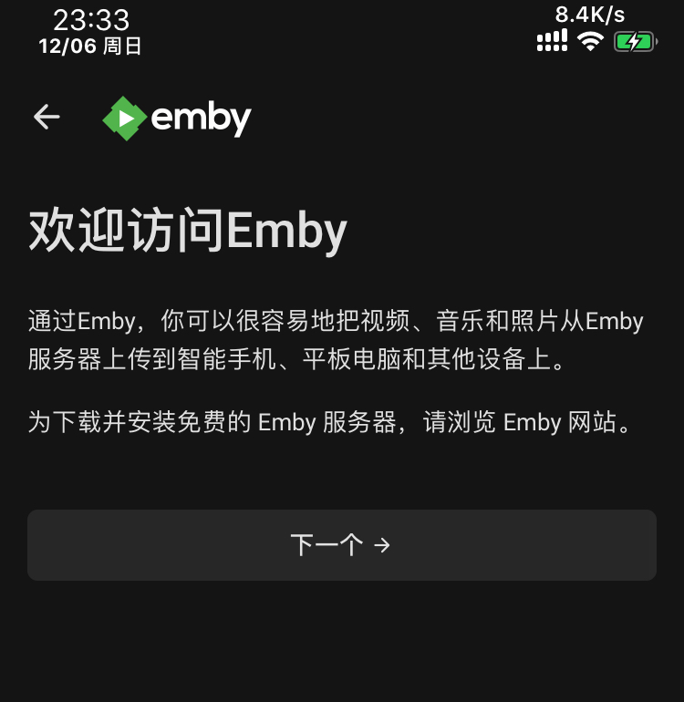
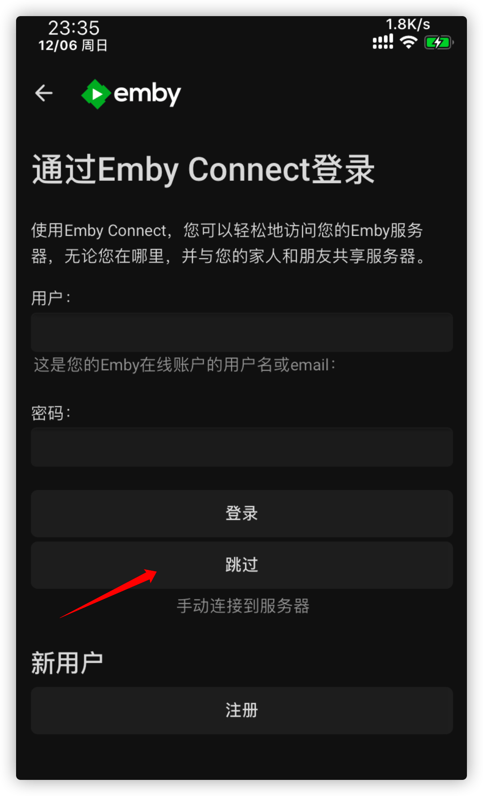
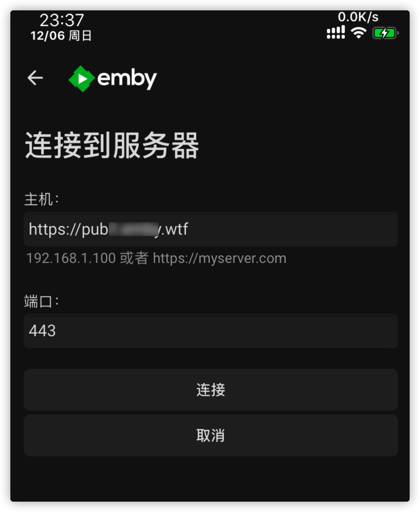
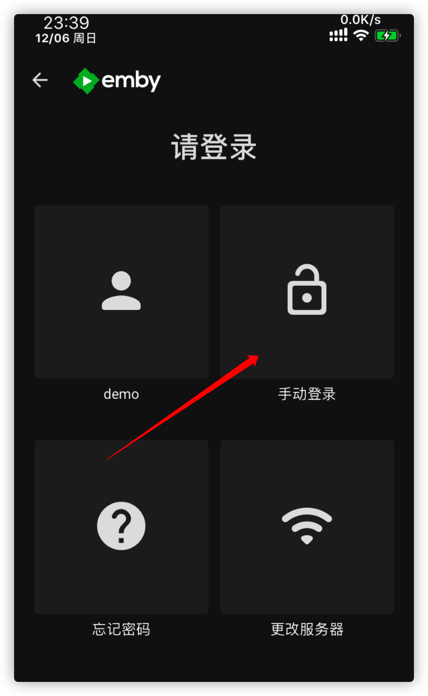
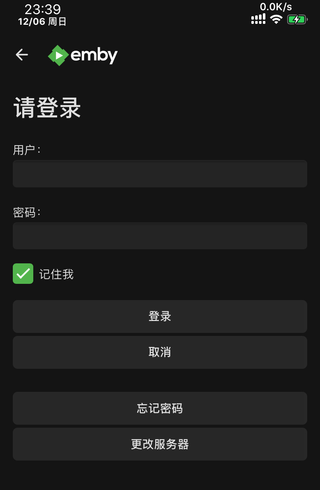
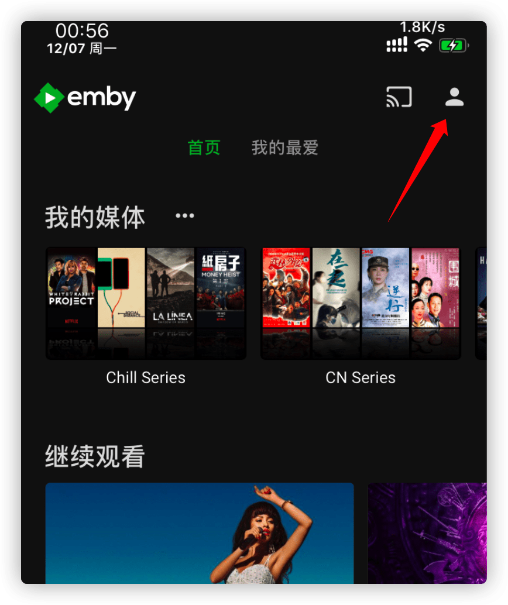
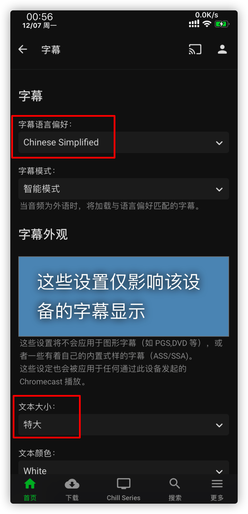
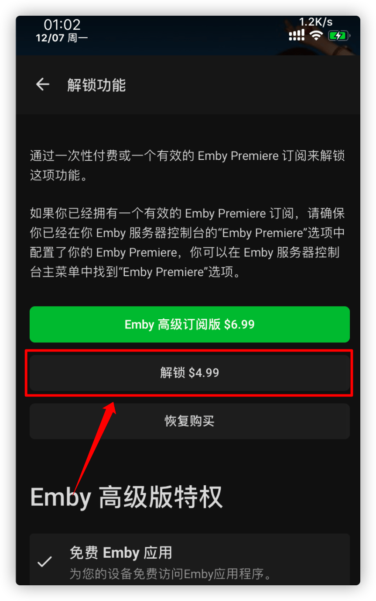

# iOS 上使用官方客户端

## 下载并安装

从 [App Store](https://itunes.apple.com/us/app/emby/id992180193?ls=1&mt=8) 下载并安装 Emby 官方客户端

## 连接 Emby 公益服务器

启动 App ，欢迎页面点 **下一个**

点击 **跳过** 按钮，我们手动连接服务器（因为 **公益服账号不是 Emby Connect 账号**，这是两个不同的东西）

填写机器人给你的公益服地址和端口号（**注意**: 机器人提供的地址和端口是写一起的，而这里要分开填写），然后点击 **连接** 按钮

点击 **手动登录** 按钮

填写自己的账号密码点击 **登录** 按钮

## 设置字幕

登录后点击右上角的小人图标，设置一下字幕

把字幕语言偏好设置成 **Chinese Simplified**（简体中文），在把 **文本大小** 根据自己需要调整一下

## 正版 或者 破解

随便开一个影片发现并不像 Android 手机客户端那样直接就可以播放了，而是要我们付费解锁（iOS 用户好欺负？）。

如果你不想麻烦也不差那点钱，可以直接点击 **解锁 $4.99**（我是美国账号，所以上图显示的是美元，如果你是国区账号要需要 30 人民币）按钮解锁。这钱是付给 Emby 官方的，公益服不收一分钱。

如果你不想付钱，请移步 [备用Wiki](https://howtogayemby.911997.xyz/use-on-various-devices/use-on-ios/use-official-client/) 看如何破解这个限制。