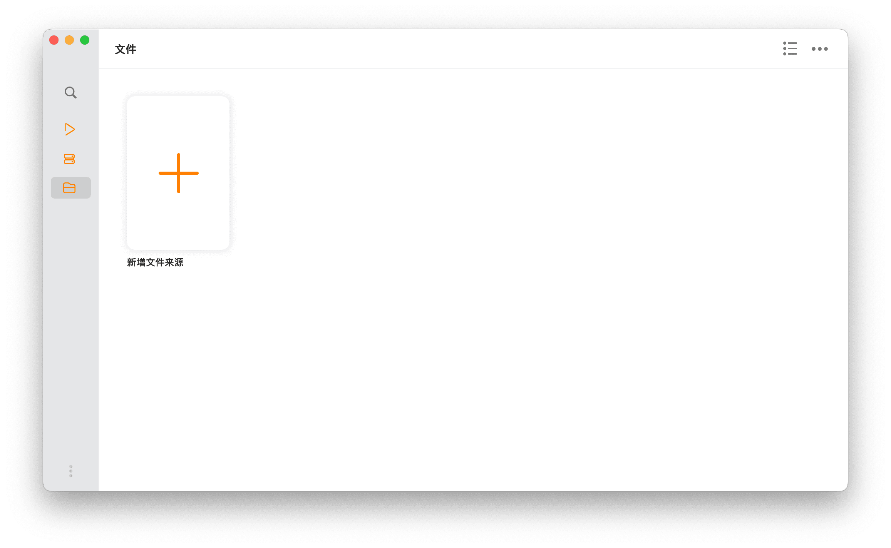
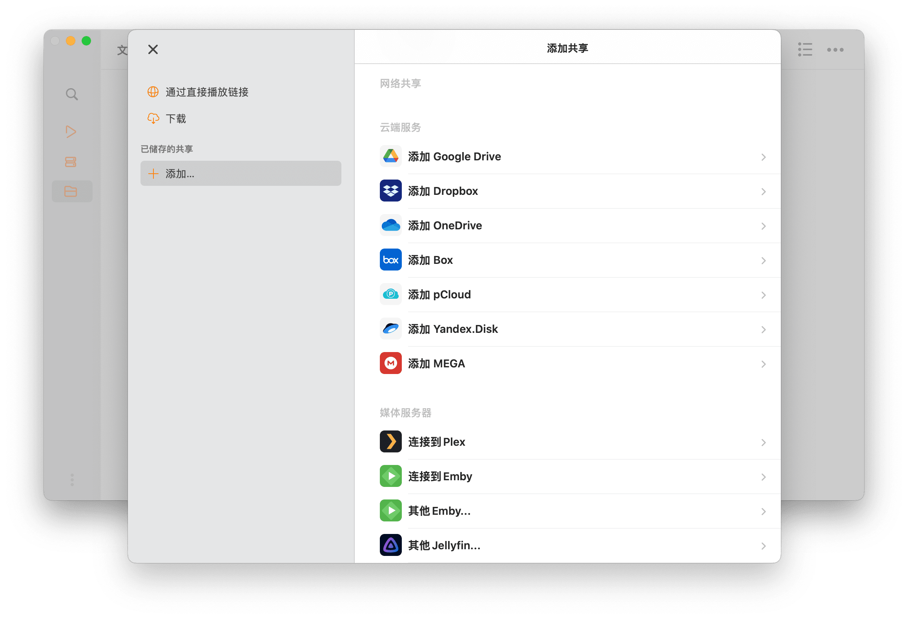
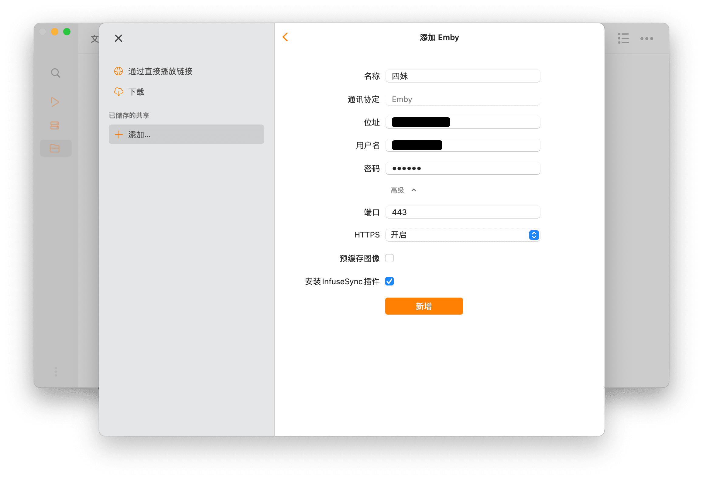
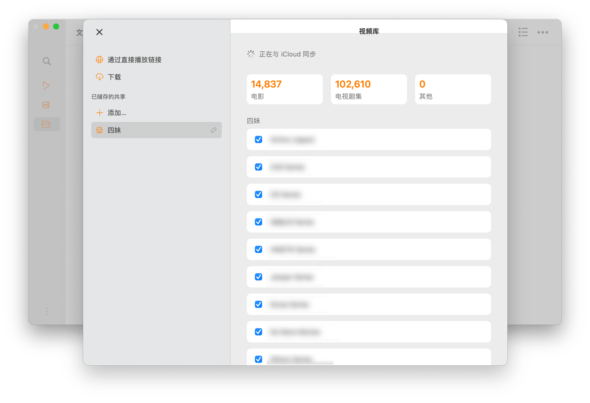
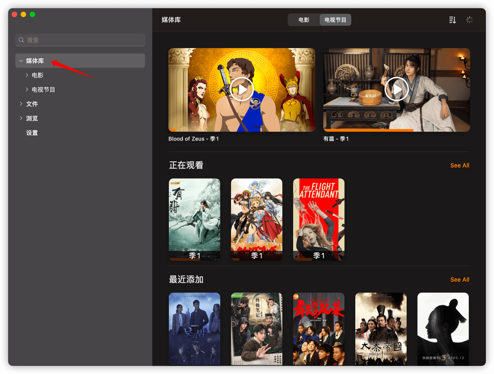
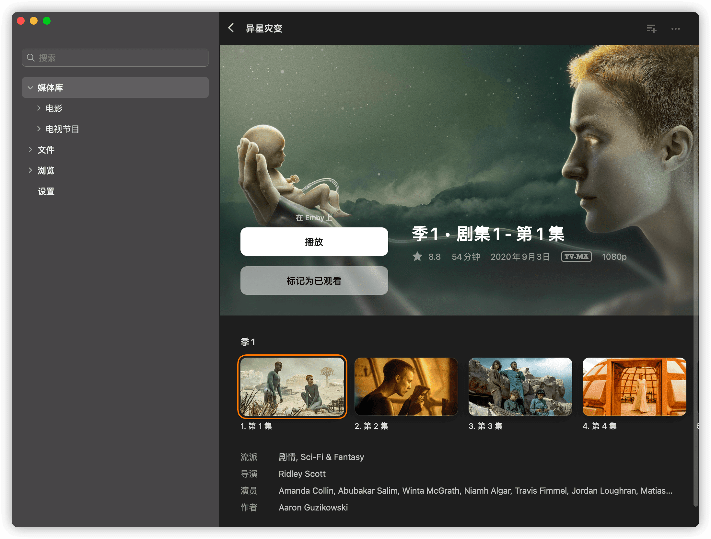
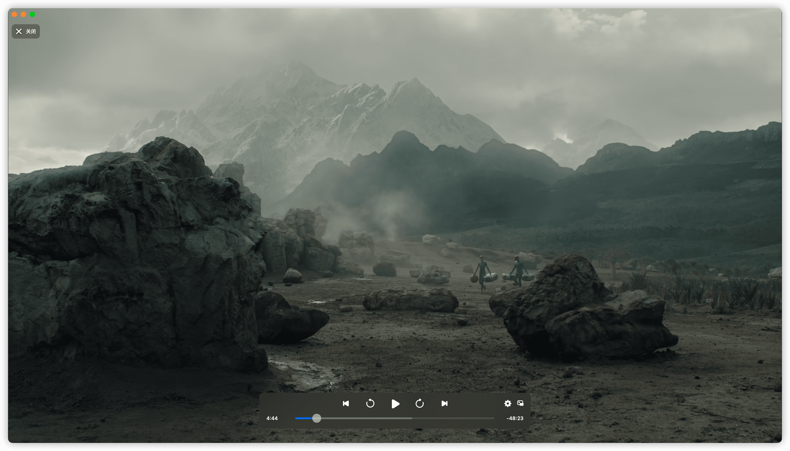

# macOS 上使用第三方客户端 Infuse

> 由于*终点站*已经禁用 Infuse 扫库，故本章已弃用。

> 2022 年 9 月 28 日，终点站上线四妹 for Infuse Only，通过万人同扫技术重新支持了 Infuse。

## 运行环境

macOS Big Sur 或更高版本

## 连接 Emby 公益服务器

启动 App ，点击 **新增文件来源**

**添加媒体服务器** -> **其他 Emby**

填写公益服的 **地址**、**端口**、**账号** 和 **密码**，然后 **保存**，点击 **新增**（注意：地址栏不用填写 https、端口以及斜杠，端口在高级中填写，HTTPS 应为 **开启**）

点击确认后等待同步完成或者查看 **设置** -> **视频库** 里的同步状态，等待同步完成

**注意**：如果同步一开始就卡住，那就去掉 “**合集**” 与 “**播放列表**” 栏目后面的 **✓**

## 播放

同步完成后打开媒体库

选择影片

播放

> Infuse 对视频的特效字幕处理非常棒，如果对字幕效果要求比较高，推荐使用！