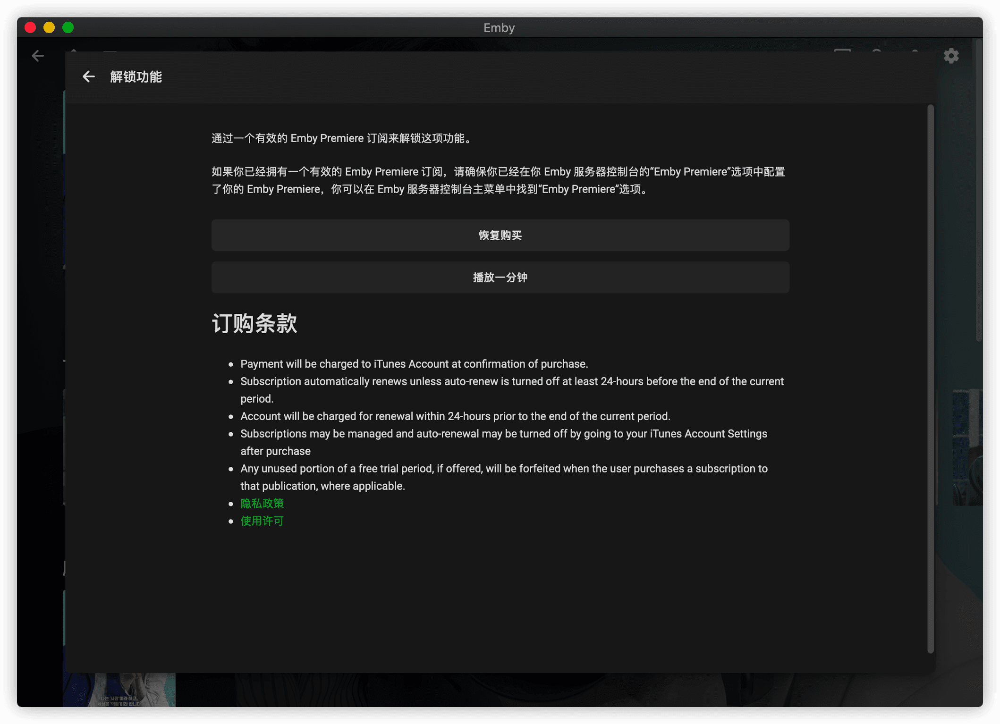

# macOS 上使用官方客户端

## 下载并安装

从 [App Store](https://itunes.apple.com/us/app/emby/id992180193?ls=1&mt=8) 下载并安装 Emby 官方客户端

## 连接 Emby 公益服务器

启动 App ，欢迎页面点 **下一个**

点击 **跳过** 按钮，我们手动连接服务器（因为公益服账号不是 Emby Connect 账号，这是两个不同的东西）

填写机器人给你的公益服地址和端口号 (**注意**: 机器人提供的地址和端口是写一起的，而这里要分开填写 )，然后点击 **连接** 按钮

点击 **手动登录** 按钮

填写自己的账号密码点击 **登录** 按钮

## 设置字幕

登录后点击右上角的小人图标，设置一下字幕

把字幕语言偏好设置成 **Chinese Simplified**（简体中文），再把 **文本大小** 根据自己需要调整一下

## 正版 或者 破解

随便开一个影片发现并不像 Android 手机客户端那样直接就可以播放了，而是要我们付费解锁。但是上面又没有像 iOS 客户端那样给出 **付费解锁** 按钮。却给一个 **恢复购买** 按钮？

从 [App Store](https://apps.apple.com/us/app/emby/id992180193) 上的 Emby 介绍页面我们发现，Emby 的苹果客户端同时支持 macOS 和 iOS，但是，经过网友测试，在 iOS 上购买后无法在 macOS 上恢复购买。

**猜测**：也许这是恢复 iOS 上购买的订阅版，并不能恢复买断？

如果你不想付钱，请移步 [备用Wiki](ss) 看如何破解这个限制。