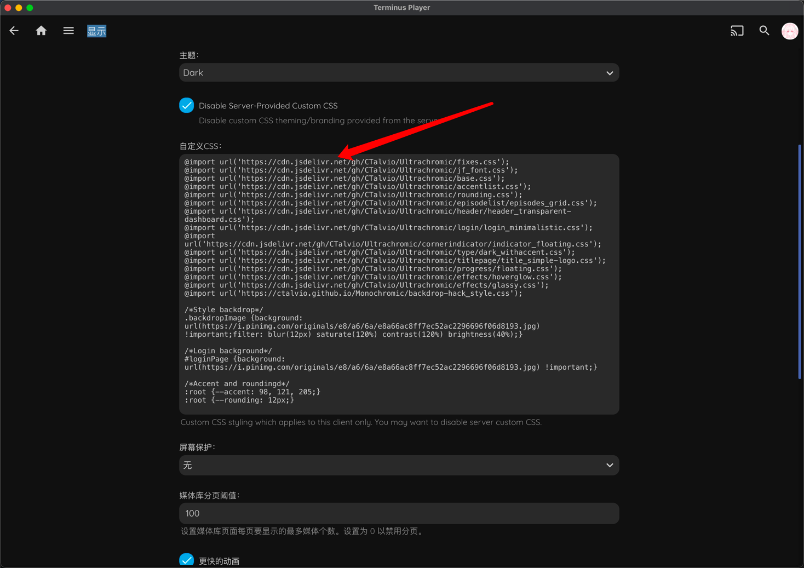
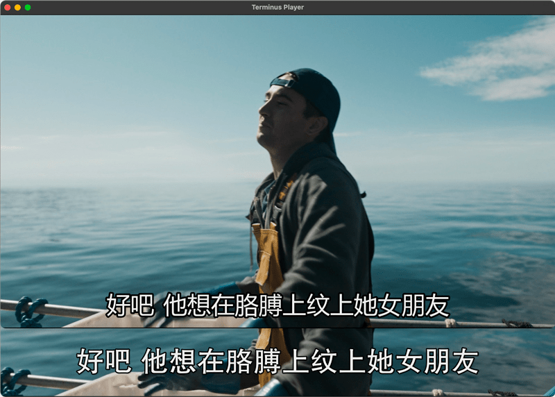

# 进阶玩法

## 自定义主题

本客户端可以使用本地 CSS 进行样式修改，[这个仓库](https://github.com/CTalvio/Ultrachromic) 有别人写好的 CSS 文件，可以自行复制粘贴进行测试，折腾出自己喜欢的样式。

> CSS 大佬可以参考该仓库的选择器进行自定义样式修改。

具体填写位置：右上角 人头 -> Display（显示） -> 自定义CSS



## 自定义 Terminus Player 播放器配置

Terminus Player 使用的是 mpv 播放器作为内核，可以自定义 mpv 配置文件来定制 mpv 播放器。下面以 macOS 端修改 srt 字幕样式来举例说明。

### 创建配置文件

在 **访达** 内按 `command + shift + g` 键，输入 `~/Library/Application Support/Terminus Player/` 前往 `Terminus Player` 文件夹，在文件夹内创建名为 `mpv.conf` 的配置文件。

### 自定义配置文件

填写下面内容：

ini

```
sub-font="方正黑体_GBK"          # 字幕字体 ( 设置的字体电脑上必须已经安装了才有效 )
sub-font-size=55               # 字幕字号
sub-color="#FFFFFFFF"          # 字幕颜色
sub-border-color="#FF262626"   # 字幕边框颜色
sub-border-size=2              # 字幕边框大小 默认: 3
sub-shadow-offset=1            # 字幕阴影位移 默认: 0
sub-shadow-color="#33000000"   # 字幕阴影颜色
sub-spacing=0.5                # 字幕水平间距 默认: 0
sub-margin-y=45                # 字幕顶部和屏幕底部边距 默认: 22
```

更多配置参数请参考 [官方文档](https://mpv.io/manual/stable/)

### 重启 Terminus Player 播放器查看修改效果



上面是大号播放器默认默认样式，下面是我们自定义的样式。