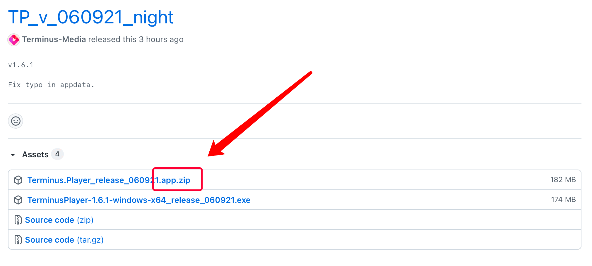
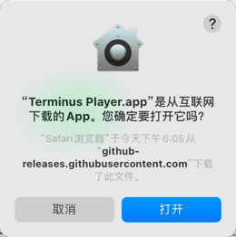
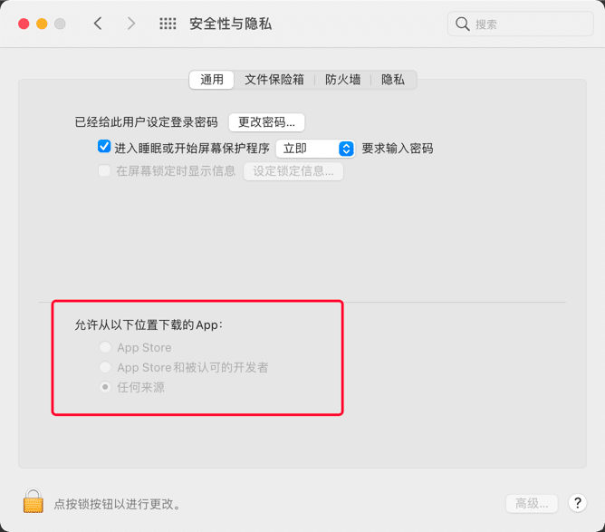
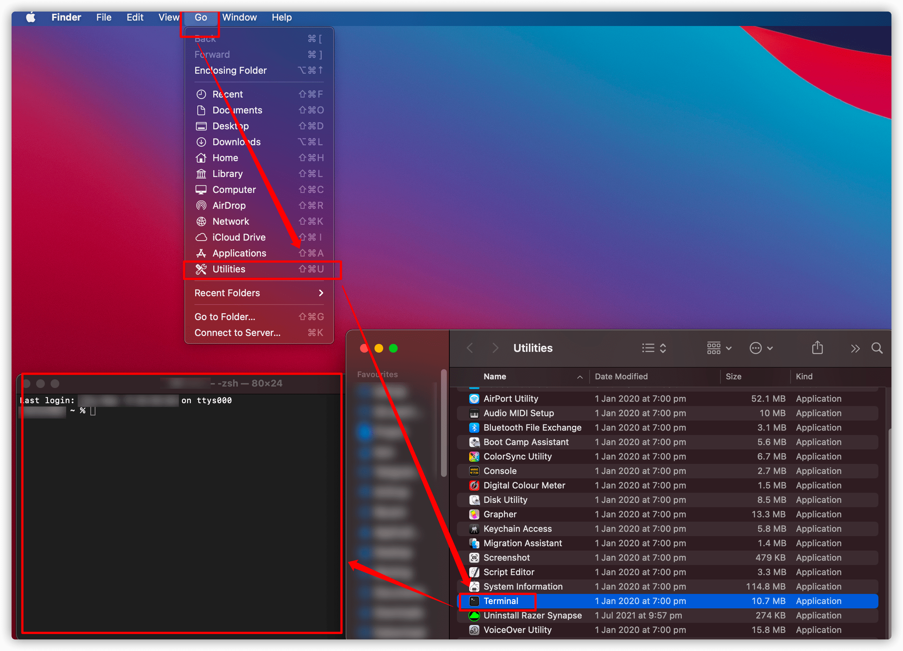
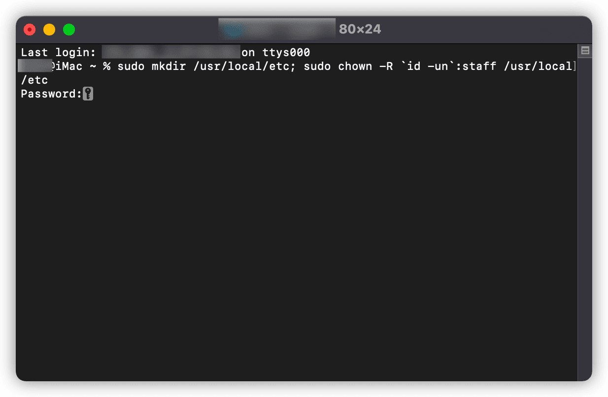
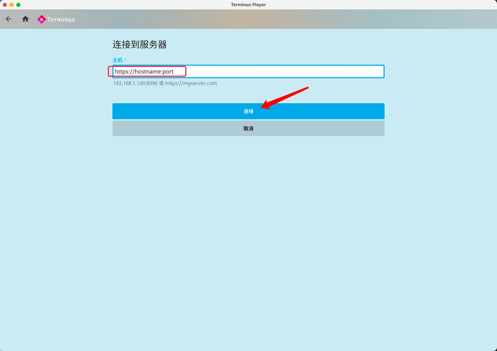
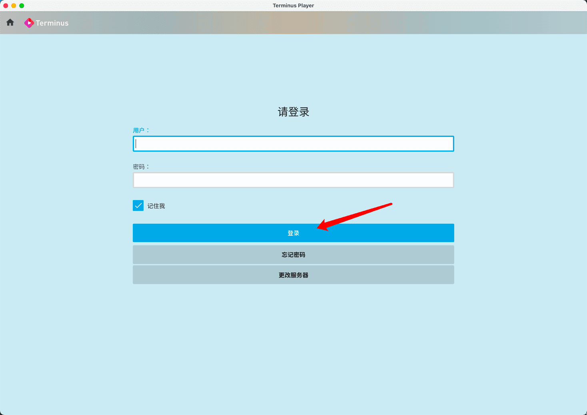
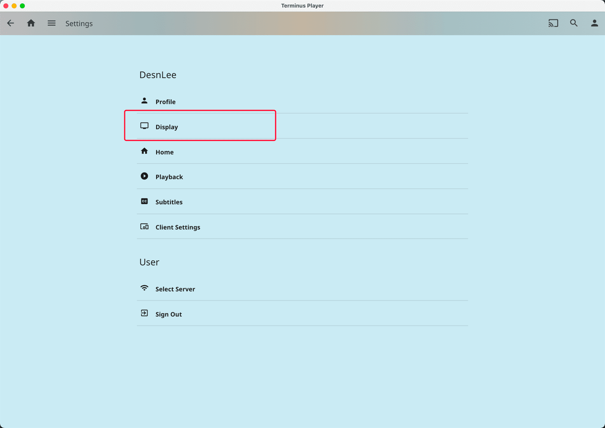
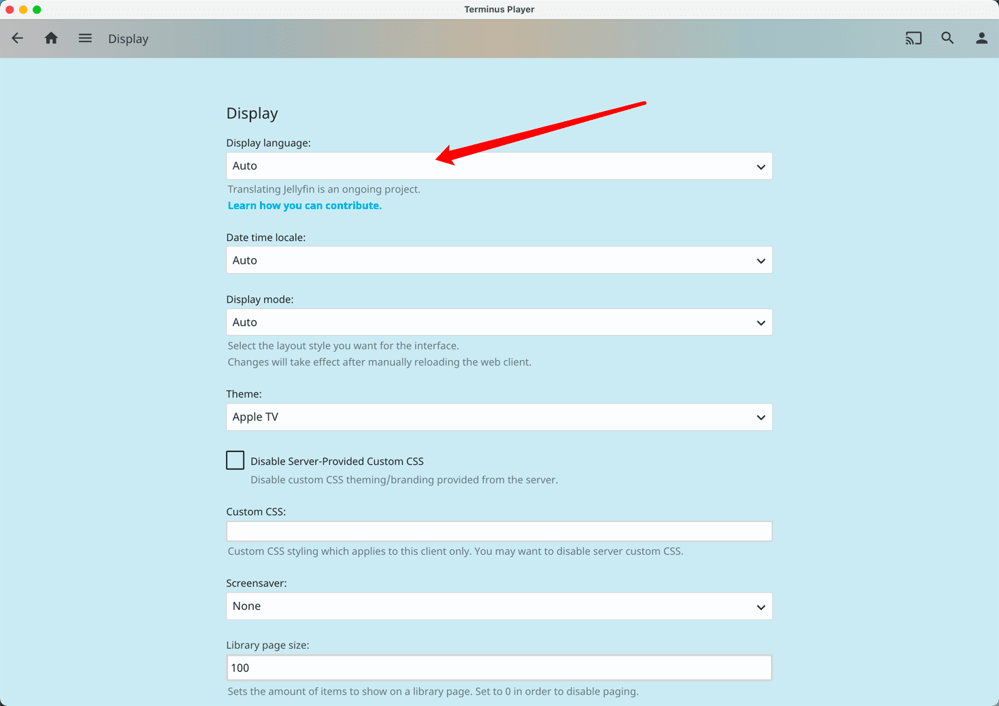
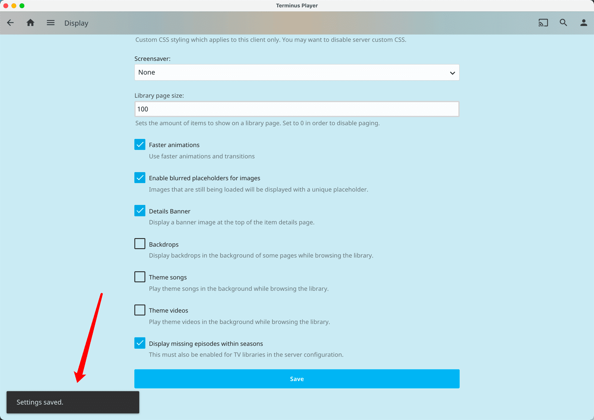

# macOS 上使用 Terminus Player

## Terminus Player 介绍

本播放器是终点站大佬基于 [Jellyfin-media-player 项目](https://github.com/jellyfin/jellyfin-media-player) 修改的一款播放器，主要特点是：

- 对原项目不支持 Emby 进行了修改，使得绝大部分功能能够正常使用；
- 界面更加美观；
- 安装、使用轻盈方便，两键（双击）安装，即可使用。

> 这是一个修改版的软件，如果报木马，提示有害软件，自行验证是否可安装。设备爆炸不负责任。

## 软件安装

从本播放器的 [github release 页面](https://github.com/Terminus-Media/jellyfin-media-player/releases) 下载安装包，如下图所示。认准后缀为 `.app.zip` 的文件，点击下载。下载完成后解压得到 `Terminus Player.app` 文件，即完成。



双击打开解压得到的文件，首次打开需要信任，单击打开选项。



## 安全性与隐私

macOS 系统默认仅允许 AppStore 来源的 App 运行，打开前请确认 左上角苹果 logo -> 系统设置 -> 安全性与隐私 -> 通用 -> 允许从以下位置下载的App 中勾选的为任何来源。（**点击左下角锁头进行更改**）



## 意外退出和闪退的解决方法

部分比较干净的系统，由于缺少一些关键位置的文件夹，导致会出现 *意外退出* 或 *闪退* 的情况，解决方法如下：

- 在 *工具(Utilities)* 中，找到并打开 *终端(Terminal)*



- 在打开的 *终端(Terminal)* 中，输入如下命令

  bash

  ```
  sudo mkdir /usr/local/etc; sudo chown -R `id -un`:staff /usr/local/etc
  ```

- 输入命令后按下回车，会提示输入用户密码，此处输入密码不会显示，密码输入后回车确认

  

- 重新打开*Terminus Player*已经可以正常打开并进入下一步的使用环节了

## 软件使用

### 添加服务器

打开 App 后，进入如下界面。在红框处输入厂妹给你的地址（**包含端口号，用英文冒号连接**），然后点击连接。



输入用户名和密码，点击登录。即可开始嫖厂妹了～



### 修改语言

进入服务器后，点击右上角小人图标，选择 Display 项，单击进入。



单击 Display Language 下方单选框，选择需要修改的语言。简体中文为 `Chinese(Simplified)`。



然后页面向下滑到底，点击底部 Save 按钮保存设置。左下角出现 Settings saved 字样即表示保存成功。此时关闭 App 重启，即可变为简体中文界面。



> 当你修改为简体中文界面之后，相信你已经可以自行玩转这个 App 了，其余设置与 Emby 官方客户端基本相同。