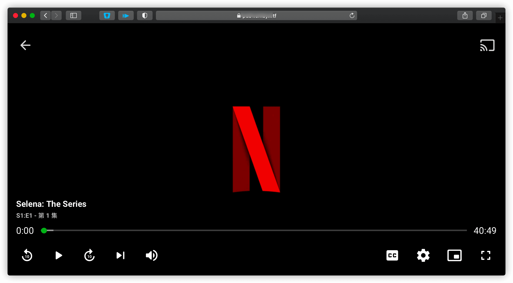
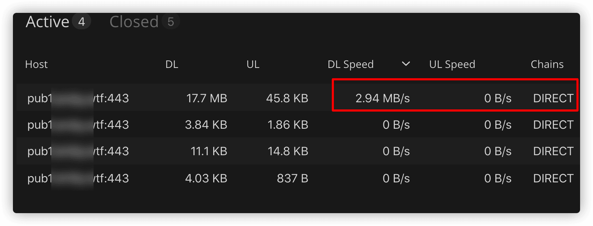
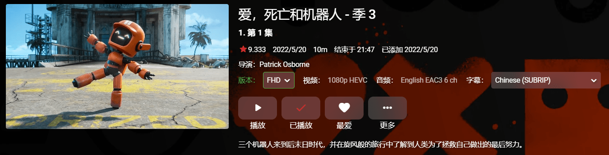
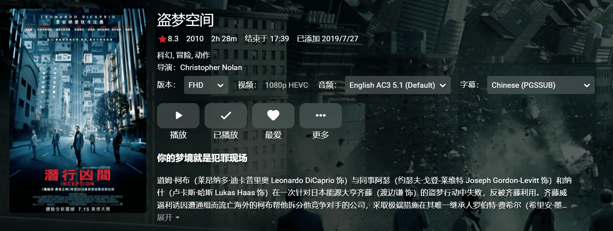

# 电脑浏览器播放

## 浏览器上播放

在电脑浏览器上播放播放其实很简单，直接打开机器人给的地址，账号密码登录播放就行了。

现在是星期天晚上9点半，属于晚高峰，我路由器上看了下直连播放速度， 1080p 的 Netflix 剧非常流畅。

## 兼容性问题

用浏览器播放你可能会遇到这样的错误，或者有声音没画面，又或者有画面没声音。

这是因为大多数浏览器在音视频/字幕解码中有兼容性问题，需要 Emby 客户端或第三方播放器才能播放。

以下是兼容性测试，基于Chrome `107.0.5304.88（正式版本） （64 位）`

- HEVC + EAC3 + ASS

  

  有画面无声音，ASS字幕无法显示

- HEVC + EAC3 + SRT

  

- HEVC + AC3 + PGS

  

  有画面无声音，PGS字幕无法显示

- HEVC + DTS-HD + PGS

  

  有画面无声音，PGS字幕无法显示

- H264 + AAC + SRT

  

  有画面有声音，SRT字幕无法显示

- H264 + DTS + PGS

  

  有画面无声音，PGS字幕无法显示

**综上，在浏览器直接观看并不是一个很好的选择。**

- 音频

  不支持DTS、Dts-HD、AC3、EAC3等格式

- 字幕

  仅支持SRT，不支持ASS、SUP、PGS等格式

但是，Emby 客户端在不同平台 ( PC / macOS / iOS / Android ) 上又有各种各样的坑，所以如果想有一个更好的播放体验，请继续往下看。