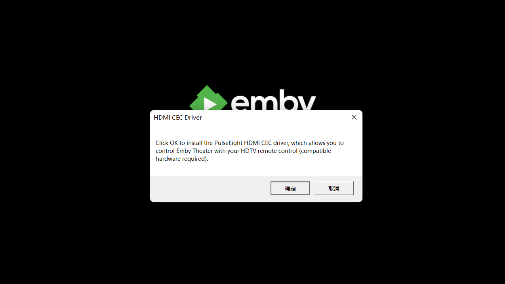
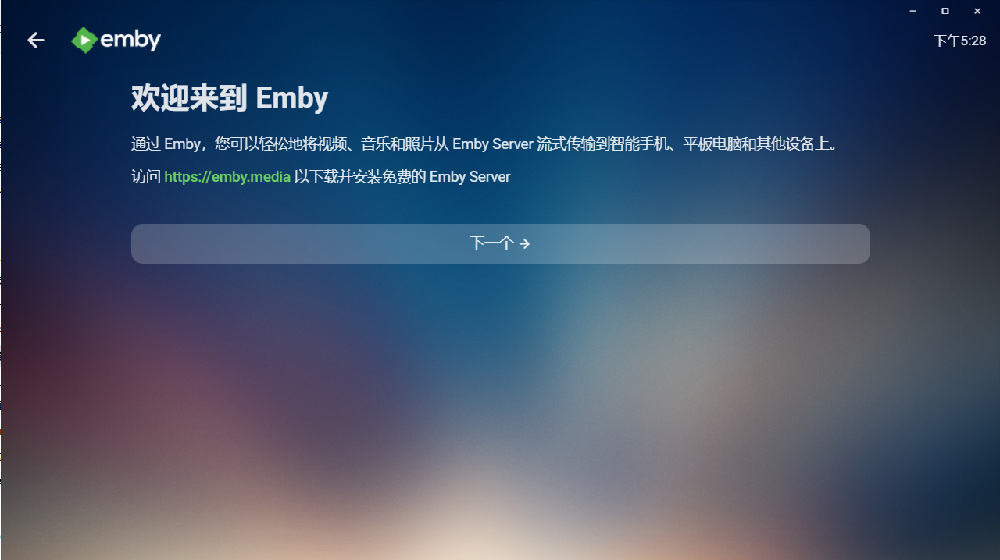
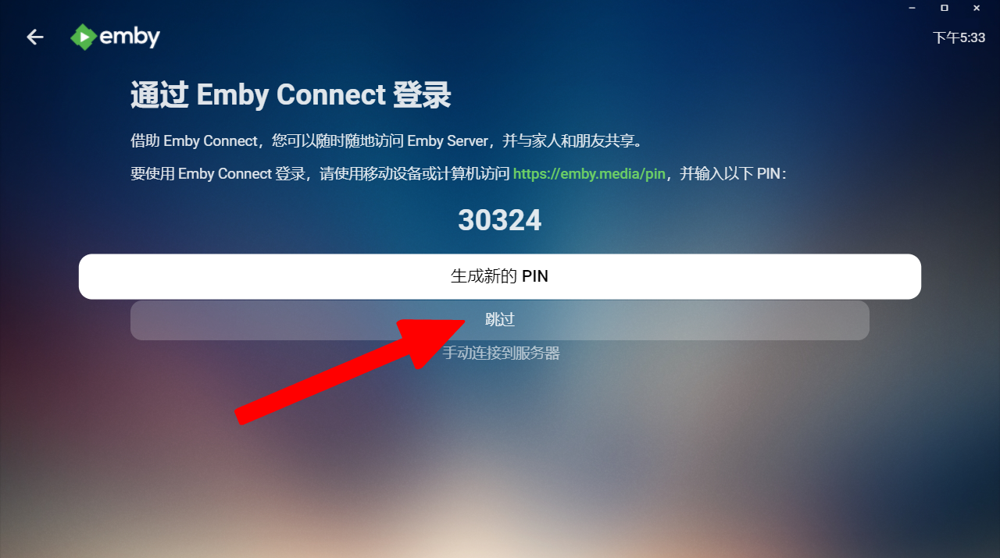
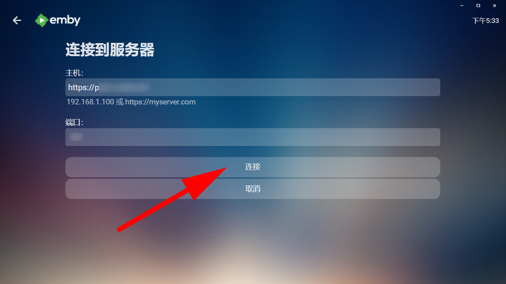
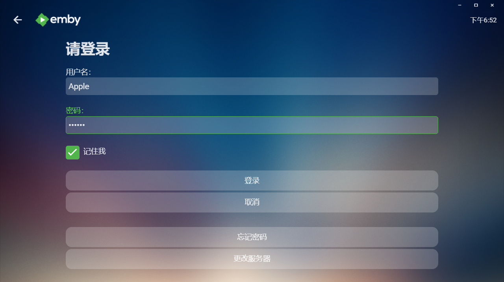
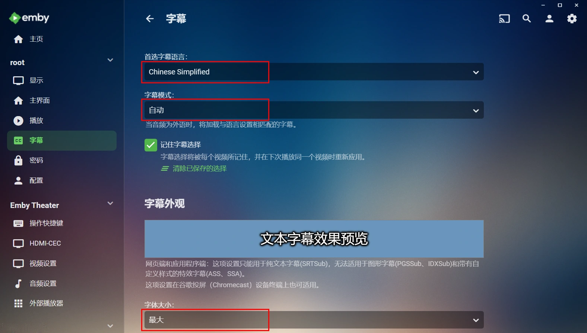

# Windows 上使用 Emby Theater

## 连接 Emby 公益服务器

启动 App ，可能会有如下提示

询问是否安装插件以使用HDTV远程遥控，可以点 **取消**

点击 **下一个**

点击 **跳过** 按钮，我们手动连接服务器 ( 因为公益服账号不是 Emby Connect 账号，这是两个不同的东西 )

填写机器人给你的公益服地址和端口号 (**注意**: 机器人提供的地址和端口是写一起的，而这里要分开填写)，然后点击 **连接** 按钮

填写自己的账号密码点击 **登录** 按钮

## 设置字幕

登录后点击右上角的小人图标，设置一下字幕

把字幕语言偏好设置成 Chinese Simplified（简体中文），再把 文本大小 根据自己需要调整一下