# Windows 上使用 Terminus Player

## Terminus Player 介绍

本播放器是终点站大佬基于 [Jellyfin-media-player 项目](https://github.com/jellyfin/jellyfin-media-player) 修改的一款播放器，主要特点是：

- 对原项目不支持 Emby 进行了修改，使得绝大部分功能能够正常使用；
- 界面更加美观；
- 安装、使用轻盈方便，两键（双击）安装，即可使用。

> 这是一个修改版的软件，如果报木马，提示有害软件，自行验证是否可安装。设备爆炸不负责任。
>
> 仅支持在Windows 10及以上系统安装使用，低于该版本的安装时会出现运行库错误。

## 软件安装

从本播放器的 [github release 页面](https://github.com/Terminus-Media/jellyfin-media-player/releases) 下载安装包，如下图所示。认准后缀为 `.exe` 的文件，点击下载，即完成。

**安装前建议关闭所有杀毒软件、防火墙，这是在原版基础上修改过的软件，会被误报木马，如心存任何疑虑，请果断退出安装。**

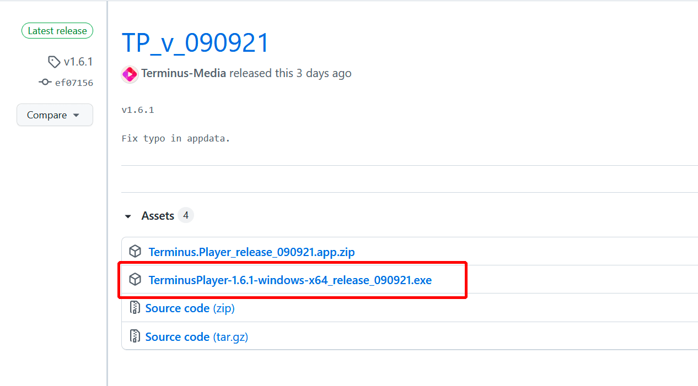

在下载位置找到安装包，双击运行

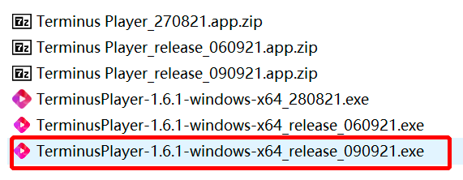

弹出警告按确认

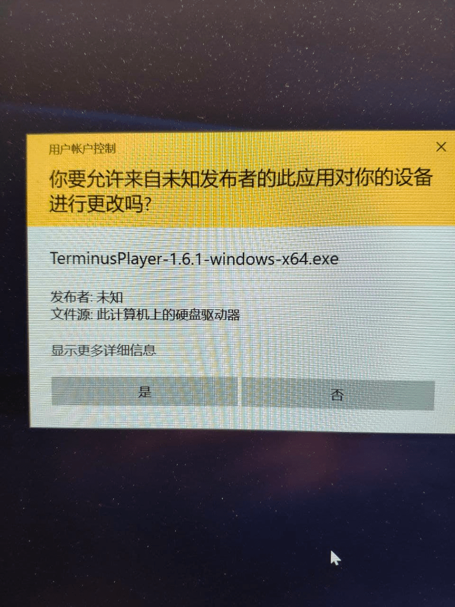

安装界面，根据需要修改相关选项和路径

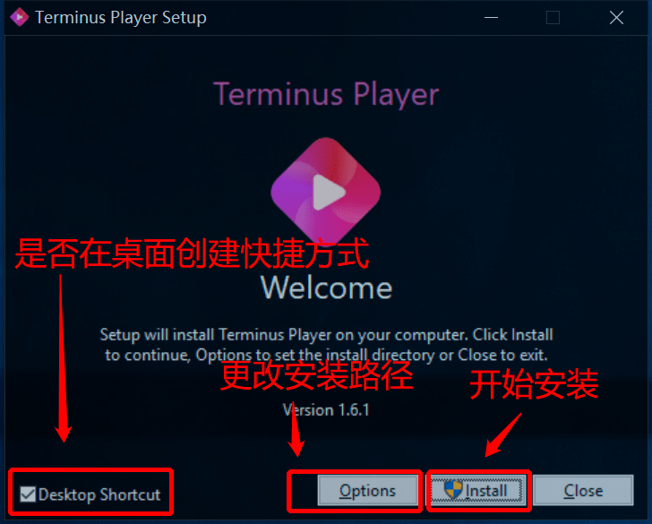

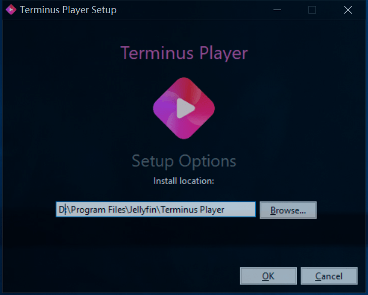

安装完毕后，重启电脑完成安装

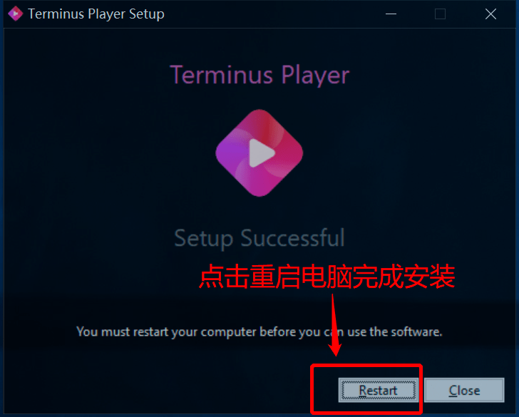

## 软件使用

打开 **Terminus Player**，点击 **Add Server** 按钮，进行服务器的添加。

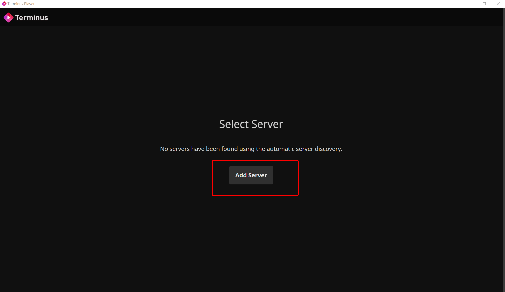

输入所需要连接的服务器地址及端口号

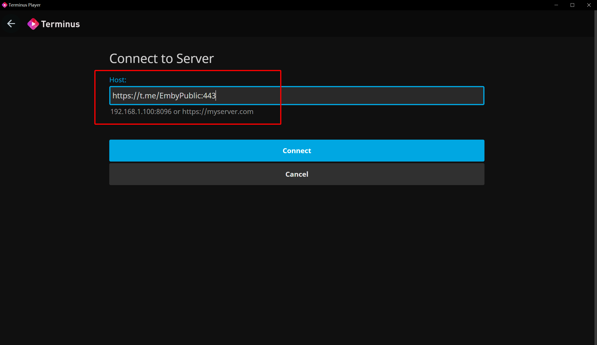

输入账户及密码

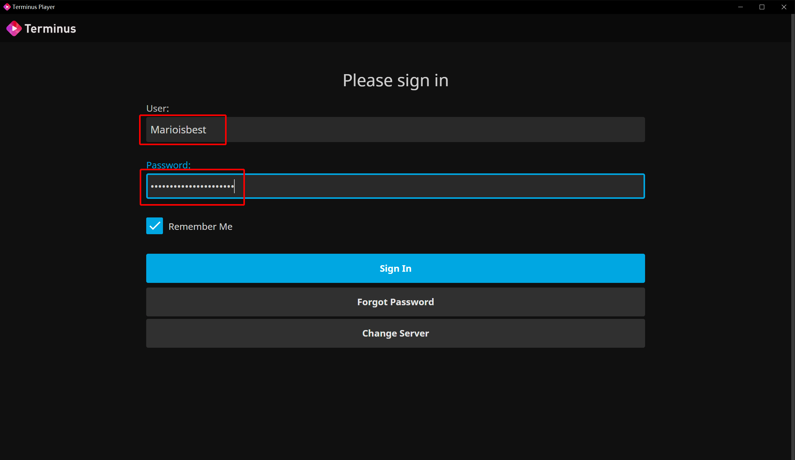

连接后即可开始享受终点站影音之旅

## 修改语言

进入服务器后，点击右上角小人图标，选择 Display 项，单击进入。

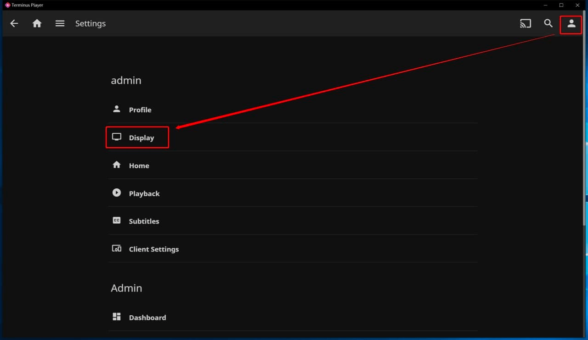

单击 Display Language 下方单选框，选择需要修改的语言。简体中文为 `Chinese(Simplified)`。

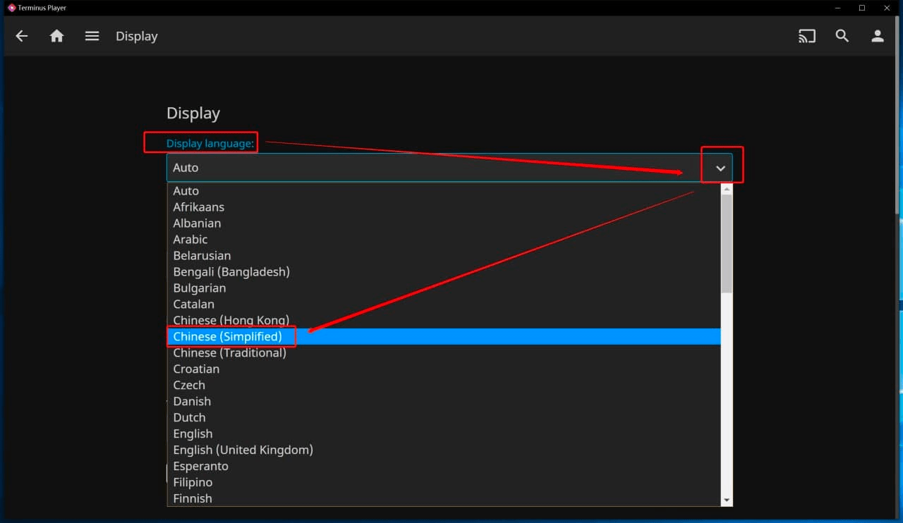

然后页面向下滑到底，点击底部 Save 按钮保存设置。左下角出现 Settings saved 字样即表示保存成功。此时关闭 App 重启，即可变为简体中文界面。

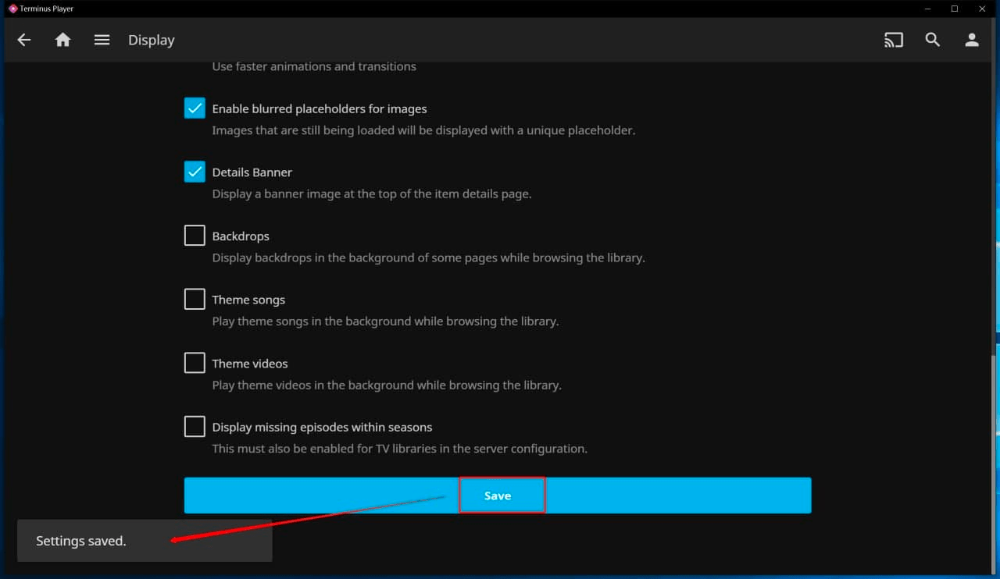

重启 **Terminus Player** 软件后，方可生效

> 当你修改为简体中文界面之后，相信你已经可以自行玩转这个 App 了，其余设置与 Emby 官方客户端基本相同。